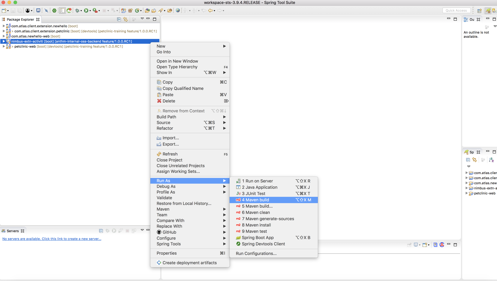
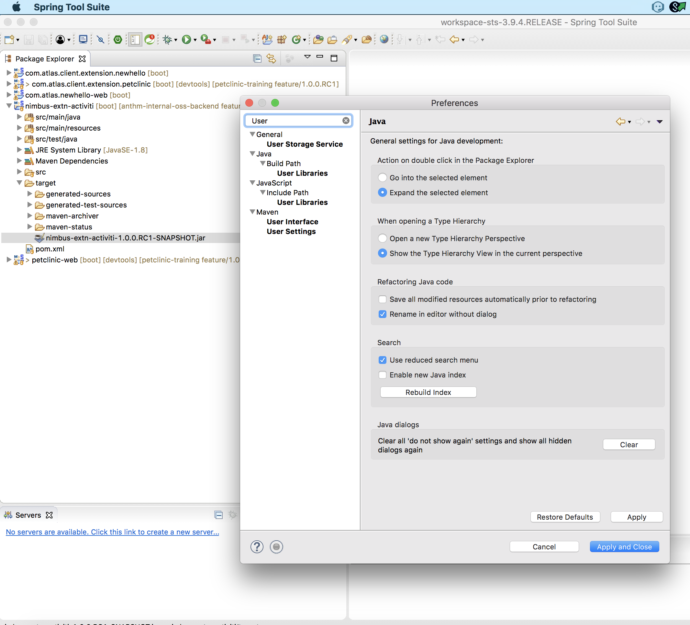

==== Opening BPMN files using activiti editor

.. Import nimbus-activiti-extension folder in STS
.. Do a Maven Build on this folder. Give the Maven Build configs as [navy]#** clean install **#
+

.. Copy the created [navy]#**nimbus-extn-activiti-1.0.0.RC1-SNAPSHOT.jar **# to a new folder other than your current workspace.
.. Click [navy]#**Spring Tool Suite->Preferences**#
+
image::actt2.png[ATT2]
.. Type User Libraries in the search bar and Click [navy]#** Java->User Libraries **#
+

.. Add [navy]#**New**# user library and name it as "Activiti Designer Extensions" (Make sure you use the same name)
..	Click [navy]#**Add external Jar**# and add the **nimbus-extn-activiti-1.0.0.RC1-SNAPSHOT.jar** (which is saved in the new location ) 
..	Right click on **com.atlas.client.extension.newhello** and select [navy]#**Build Path -> Configure Build Path**# 
..	Click [navy]#**Add Library > User Library > **# select the check box [navy]#** "Activiti Designer Extensions" **#
..	Create a new folder named “process” under [navy]#**com.atlas.client.extension.newhello -> src/main/resources **#
..	Create a new BPMN process file named ** test.bpmn20.xml** and paste the following content
+
[source,xml]
-------
<?xml version="1.0" encoding="UTF-8"?>
<definitions xmlns="http://www.omg.org/spec/BPMN/20100524/MODEL" xmlns:xsi="http://www.w3.org/2001/XMLSchema-instance" xmlns:xsd="http://www.w3.org/2001/XMLSchema"xmlns:activiti="http://activiti.org/bpmn" xmlns:bpmndi="http://www.omg.org/spec/BPMN/20100524/DI" xmlns:omgdc="http://www.omg.org/spec/DD/20100524/DC"xmlns:omgdi="http://www.omg.org/spec/DD/20100524/DI" typeLanguage="http://www.w3.org/2001/XMLSchema" expressionLanguage="http://www.w3.org/1999/XPath"targetNamespace="http://www.activiti.org/test">
  <process id="addreasonsmainfocus" name="My process" isExecutable="true">
    <exclusiveGateway id="exclusivegateway1" name="Exclusive Gateway"></exclusiveGateway>
    <startEvent id="startevent1" name="Start"></startEvent>
    <sequenceFlow id="flow1" sourceRef="startevent1" targetRef="exclusivegateway1"></sequenceFlow>
    <endEvent id="endevent1" name="End"></endEvent>
    <serviceTask id="resetcurrentMainFocus" name="Reset current MainFocus" activiti:delegateExpression="${commandExecutorTaskDelegate}"activiti:extensionId="com.anthem.nimbus.platform.core.extension.activiti.CommandExecutorTask">
      <extensionElements>
        <activiti:field name="url">
          <activiti:string>/reasonsForMgmtPage/reasonForMgmtTile/reasonForMgmtSection/reasonForMgmtForm/action_resetMainFocusFlag/_get</activiti:string>
        </activiti:field>
      </extensionElements>
    </serviceTask>
    
       <serviceTask id="validationErrorReasonForMgmt" name="Records Exits With Program type and Reason " activiti:delegateExpression="${commandExecutorTaskDelegate}"activiti:extensionId="com.anthem.nimbus.platform.core.extension.activiti.CommandExecutorTask">
      <extensionElements>
        <activiti:field name="url">
          <activiti:string>/reasonsForMgmtPage/reasonForMgmtTile/reasonForMgmtSection/reasonForMgmtForm/action_error/_get</activiti:string>
        </activiti:field>
      </extensionElements>
    </serviceTask>
    
    <serviceTask id="updateNewMainFocus" name="update New MainFocus and Add Reason for Mgmt" activiti:delegateExpression="${commandExecutorTaskDelegate}"activiti:extensionId="com.anthem.nimbus.platform.core.extension.activiti.CommandExecutorTask">
      <extensionElements>
        <activiti:field name="url">
          <activiti:string>/reasonsForMgmtPage/reasonForMgmtTile/reasonForMgmtSection/reasonForMgmtForm/action_success/_get</activiti:string>
        </activiti:field>
      </extensionElements>
    </serviceTask>
    <sequenceFlow id="flow2" sourceRef="updateNewMainFocus" targetRef="endevent1"></sequenceFlow>
    <sequenceFlow id="flow3" sourceRef="resetcurrentMainFocus" targetRef="endevent1"></sequenceFlow>
    <sequenceFlow id="flow4" sourceRef="validationErrorReasonForMgmt" targetRef="endevent1"></sequenceFlow>
    <sequenceFlow id="flow5" sourceRef="exclusivegateway1" targetRef="resetcurrentMainFocus">
      <conditionExpression xsi:type="tFormalExpression"><![CDATA[findStateByPath("/reasonsForMgmtPage/reasonForMgmtTile/reasonForMgmtSection/reasonForMgmtForm/validateFormStatus") == 'action_resetMainFocusFlag']]></conditionExpression>
    </sequenceFlow>
    <sequenceFlow id="flow6" sourceRef="exclusivegateway1" targetRef="updateNewMainFocus">
      <conditionExpression xsi:type="tFormalExpression"><![CDATA[findStateByPath("/reasonsForMgmtPage/reasonForMgmtTile/reasonForMgmtSection/reasonForMgmtForm/validateFormStatus") == 'action_success']]></conditionExpression>
    </sequenceFlow>
      <sequenceFlow id="flow7" sourceRef="exclusivegateway1" targetRef="validationErrorReasonForMgmt">
      <conditionExpression xsi:type="tFormalExpression"><![CDATA[findStateByPath("/reasonsForMgmtPage/reasonForMgmtTile/reasonForMgmtSection/reasonForMgmtForm/validateFormStatus") == 'action_error']]></conditionExpression>
    </sequenceFlow>
  </process>
  <bpmndi:BPMNDiagram id="BPMNDiagram_mainfocus">
    <bpmndi:BPMNPlane bpmnElement="mainfocus" id="BPMNPlane_mainfocus">
      <bpmndi:BPMNShape bpmnElement="exclusivegateway1" id="BPMNShape_exclusivegateway1">
        <omgdc:Bounds height="40.0" width="40.0" x="250.0" y="240.0"></omgdc:Bounds>
      </bpmndi:BPMNShape>
      <bpmndi:BPMNShape bpmnElement="startevent1" id="BPMNShape_startevent1">
        <omgdc:Bounds height="35.0" width="35.0" x="100.0" y="243.0"></omgdc:Bounds>
      </bpmndi:BPMNShape>
      <bpmndi:BPMNShape bpmnElement="endevent1" id="BPMNShape_endevent1">
        <omgdc:Bounds height="35.0" width="35.0" x="660.0" y="260.0"></omgdc:Bounds>
      </bpmndi:BPMNShape>
      <bpmndi:BPMNShape bpmnElement="resetcurrentMainFocus" id="BPMNShape_resetcurrentMainFocus">
        <omgdc:Bounds height="55.0" width="181.0" x="392.0" y="160.0"></omgdc:Bounds>
      </bpmndi:BPMNShape>
         <bpmndi:BPMNShape bpmnElement="validationErrorReasonForMgmt" id="BPMNShape_validationErrorReasonForMgmt">
        <omgdc:Bounds height="55.0" width="181.0" x="392.0" y="160.0"></omgdc:Bounds>
      </bpmndi:BPMNShape>
      
      <bpmndi:BPMNShape bpmnElement="updateNewMainFocus" id="BPMNShape_updateNewMainFocus">
        <omgdc:Bounds height="55.0" width="143.0" x="392.0" y="320.0"></omgdc:Bounds>
      </bpmndi:BPMNShape>
      <bpmndi:BPMNEdge bpmnElement="flow1" id="BPMNEdge_flow1">
        <omgdi:waypoint x="135.0" y="260.0"></omgdi:waypoint>
        <omgdi:waypoint x="250.0" y="260.0"></omgdi:waypoint>
      </bpmndi:BPMNEdge>
      <bpmndi:BPMNEdge bpmnElement="flow2" id="BPMNEdge_flow2">
        <omgdi:waypoint x="463.0" y="320.0"></omgdi:waypoint>
        <omgdi:waypoint x="677.0" y="295.0"></omgdi:waypoint>
      </bpmndi:BPMNEdge>
      <bpmndi:BPMNEdge bpmnElement="flow3" id="BPMNEdge_flow3">
        <omgdi:waypoint x="482.0" y="215.0"></omgdi:waypoint>
        <omgdi:waypoint x="677.0" y="260.0"></omgdi:waypoint>
      </bpmndi:BPMNEdge>
      <bpmndi:BPMNEdge bpmnElement="flow4" id="BPMNEdge_flow4">
        <omgdi:waypoint x="270.0" y="240.0"></omgdi:waypoint>
        <omgdi:waypoint x="270.0" y="187.0"></omgdi:waypoint>
        <omgdi:waypoint x="392.0" y="187.0"></omgdi:waypoint>
      </bpmndi:BPMNEdge>
      <bpmndi:BPMNEdge bpmnElement="flow5" id="BPMNEdge_flow5">
        <omgdi:waypoint x="270.0" y="280.0"></omgdi:waypoint>
        <omgdi:waypoint x="270.0" y="347.0"></omgdi:waypoint>
        <omgdi:waypoint x="392.0" y="347.0"></omgdi:waypoint>
      </bpmndi:BPMNEdge>
      <bpmndi:BPMNEdge bpmnElement="flow6" id="BPMNEdge_flow6">
        <omgdi:waypoint x="270.0" y="280.0"></omgdi:waypoint>
        <omgdi:waypoint x="270.0" y="347.0"></omgdi:waypoint>
        <omgdi:waypoint x="392.0" y="347.0"></omgdi:waypoint>
      </bpmndi:BPMNEdge>
      <bpmndi:BPMNEdge bpmnElement="flow7" id="BPMNEdge_flow7">
        <omgdi:waypoint x="270.0" y="280.0"></omgdi:waypoint>
        <omgdi:waypoint x="270.0" y="347.0"></omgdi:waypoint>
        <omgdi:waypoint x="392.0" y="347.0"></omgdi:waypoint>
      </bpmndi:BPMNEdge>
    </bpmndi:BPMNPlane>
  </bpmndi:BPMNDiagram>
</definitions>
-------
.. Right click the file and select [navy]#** Open with > Other > Activiti Diagram Editor **#
.. 	Create your diagrams!