= NIMBUS FRAMEWORK BOOTCAMP TRAINING- MODULE 1
:docinfo: shared,private-head
:revnumber: v1.1
:revdate: 8.10.2018
:revremark: First draft
:source-highlighter: prettify
:sectnums:                                                          
:toc: left                                                             
:toclevels: 4                                                       
:toc-title: Table of Contents                                              
:experimental:                                                      
:description: NIMBUS AsciiDoc document                             
:keywords: AsciiDoc  

[.text-center]
[big navy]*MODULE 1*
[.text-center]
[big navy]*SETTING UP DEVLEOPMENT ENVIRONMENT IN MACBOOK*

=== Introduction

This module helps to set up the development environment for nimbus framework.

=== Audience

This training is designed for java programmers who needs to do the initial development enviornment set up to work with nimbus framework

=== Technical Pre-requisites

The developers are expected to have -

* Experience in Spring Framework
* Good Understanding of:
 ** Java Programming
 ** Maven
 ** Docker
 ** MongoDB

=== Installables
.Development Softwares
[cols="2",options="header"]
|=========================================================
|Application Name | Version 

|Java	|1.8.0_73 
|Maven	 |3.5.3
|Lombok	|1.16.18
|NodeJs	|Latest
|STS	|3.9.1 RELEASE 
|VS Code	|1.14.2 
|Docker	|Docker CE 17.06 
|Robo 3T	|latest (1.0)
|Kitematic	|v0.17.1
|Chrome	|latest
|Advanced Rest Client	|9.14.64.305-stable

|=========================================================

NOTE: Above s/w versions are compatible with Nimbus f/w version    **1.1.0.M1-SNAPSHOT**.
      The versions are subjected to change.

=== Installations

==== Installation of Homebrew
..	Let’s begin by installing Homebrew ,through which we will install other softwares
..	Go to [blue]#** https://brew.sh/ **#
+
image::Homebrew_install.png[HB]

.. Copy the command below and run the same in your terminal
+
[subs="quotes"]
-----------------------------------
*/usr/bin/ruby -e "$(curl -fsSL https://raw.githubusercontent.com/Homebrew/install/master/install)"* 
----------------------------------- 

.. This will prompt for your domain password. Enter the password to begin the installation
+
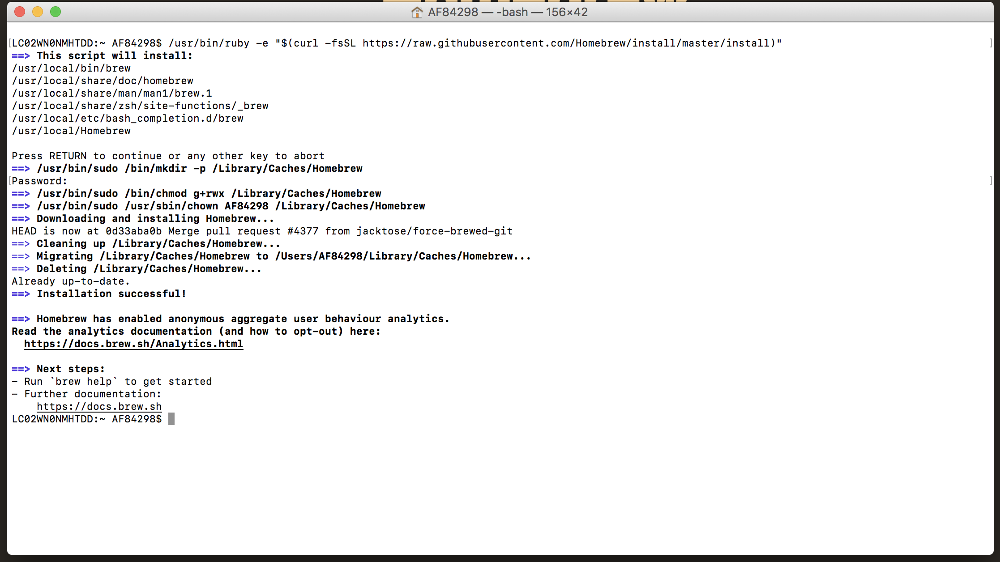

.. Now we have installed Homebrew. Let's check the version by running [navy]#**$ brew --version**# command on your terminal
+
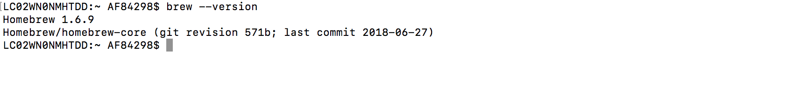

==== Installation of JDK
..	Run the following brew formula in your terminal
+
[subs="quotes"]
-----------------------------------
*$ brew update
$ brew tap caskroom/versions
$ brew cask install java8*

-----------------------------------

.. This formula prompts for your password. Enter the password to begin the installation of the latest version of java. Get the version by running the formula: [navy]#** $ java -version **# 
+
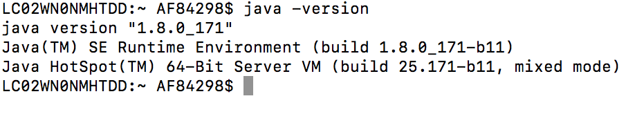

==== Installation of Maven

..	Run the brew formula  [navy]#** $ brew install maven **# on your terminal. 
..	Once installed, get the version by running the formula        [navy]#** $ mvn -v **#                    on your terminal

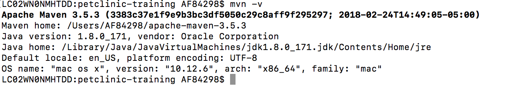

==== Installation of git

..	Run the brew formula  [navy]#** $ brew install git **#  on your terminal. 
.. Once installed, we can check the installation by running formula        [navy]#** $ git --version **#   on your terminal
.. The terminal shows the following output:

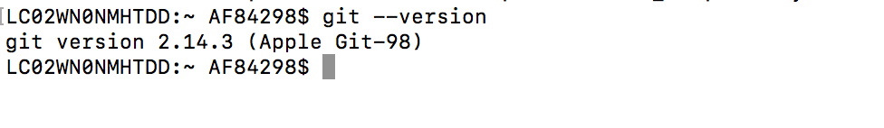

==== Installation of node.js

.. Run the brew formula  [navy]#** $ brew install node **# on your terminal. 
.. Once installed, get the version by running the formula        [navy]#** $ node -v **#   and  [navy]#** $ npm -v **# on your terminal

+
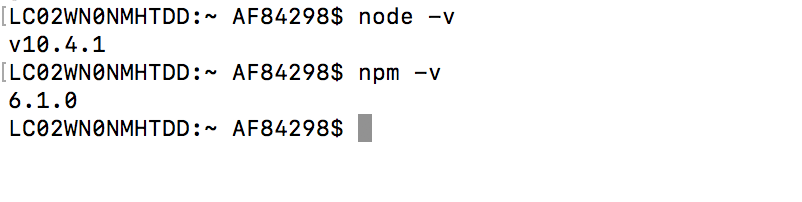

==== Installation of Docker

..	Go to [blue]#** https://docs.docker.com/v17.12/docker-for-mac/install/#download-docker-for-mac **#
..	Prefer  Stable Docker version over Edge.
..	Double click [navy]#** Docker.dmg **# and open the installer
..	Drag Moby the whale to your [blue]#**"/Applications"**# folder
+
image::dckr1.png[DV1]
.. Go to [blue]#**"/Applications"**# folder and double-click Docker.app to start Docker 
+
image::dckr2.png[DV2]
.. The docker app(the whale icon) would be shown in your status bar. You can also access the same from your terminal
+
image::dckr3.png[DV3,500]

..	Click the whale icon to see that it is running
+
image::dckr4.png[DV4,300]

..	Check the version from your terminal 
+
image::dckr5.png[DV5]

==== Installation of Spring Tool Suite 

..	Run the following brew formulae on your terminal 
+
[subs="quotes"]
-----------------------------------
*$ brew update
$ brew tap caskroom/cask
$ brew cask search sts
$ brew cask info sts
$ brew cask install sts*
-----------------------------------

.. [navy]#**STS**# will be installed in your [blue]#**"/Downloads" **# folder
.. To run STS, open the [blue]#** "/Downloads"**# folder and click on the **"STS"** icon

==== Installation of Drools Plugin

..	Open [navy]#**  STS **#  
..	Click on [navy]#**Help -> Install new software **#      
+
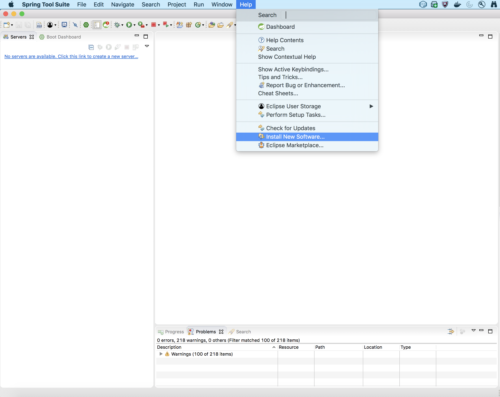

.. Enter [navy]#**Work with**#  as [blue]#** http://download.jboss.org/drools/release/5.5.0.Final/org.drools.updatesite/ **# and click [navy]#**Add **#
+
image::drls2.png[DR5]

.. Enter [navy]#**Name **# as Drools and [navy]#**Location **# as [blue]#**http://download.jboss.org/drools/release/5.5.0.Final/org.drools.updatesite/ **#
+
image::drls3.png[DR5]
.. Select the check boxes appropriate for drools
.. You may leave **JBoss jBPM task** and **JBoss jBPM Core** unchecked
.. Follow the installation instruction
.. Restart the [navy]#**STS**# when prompted

==== Installation of Lombok

.. Download lombok.jar from [blue]#**https://projectlombok.org/setup/eclipse **#
..	Right click [navy]#**lombok.jar**# and open 
+
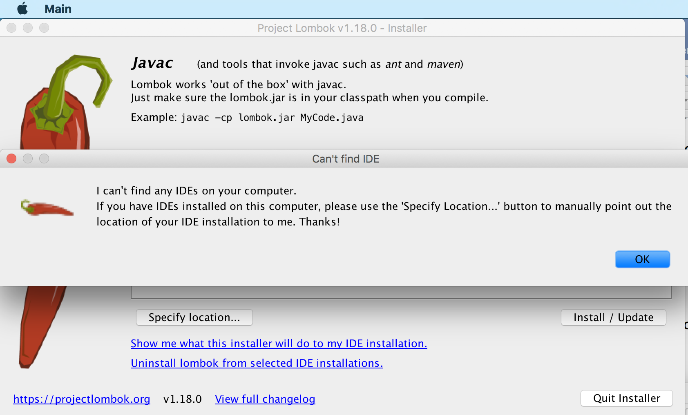

.. Click [navy]#**OK **#. Now click [navy]#**Specify Location **# and choose [navy]#**STS -> Contents ->Eclipse -> STS.ini **#
+
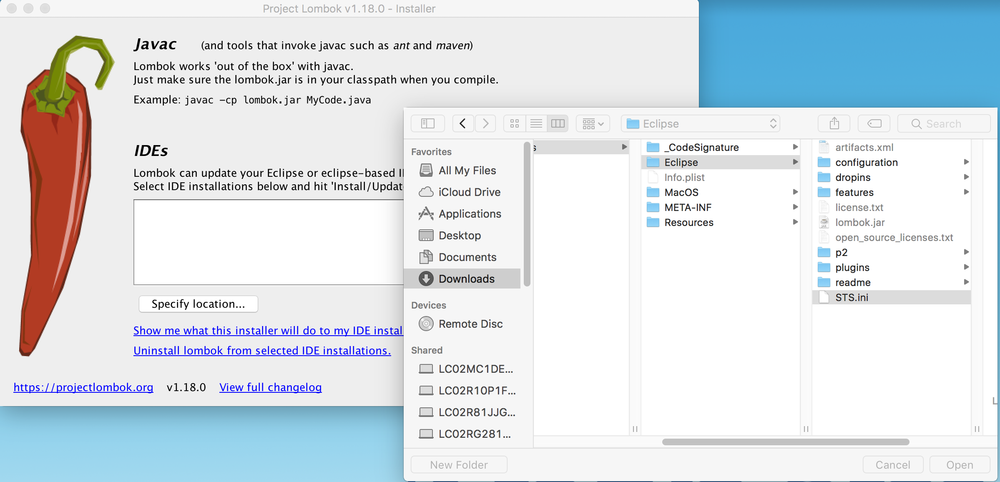
.. Click [navy]#**Install/Update **# to begin the installation
.. We can check the Lombok installation by clicking [navy]#**Spring Tool Suit->About **#
+
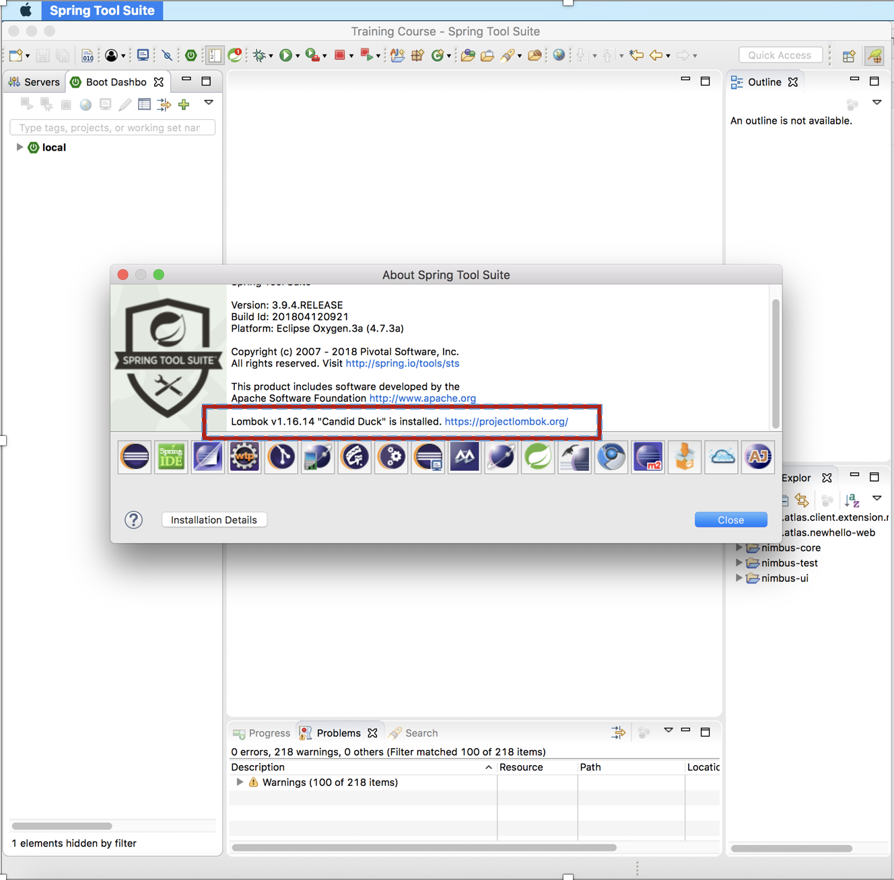

==== Install Activiti plugin

.. Open [navy]#** STS **#  
.. Click on [navy]#**Help -> Install new software**#       
+

.. Click [navy]#**  Add **#  
+
image::act2.png[AT2]
.. Enter the [navy]#**Name **# as Activiti designer and [navy]#**Location **# as [blue]#** http://activiti.org/designer/update **# and click [navy]#** OK **#
+
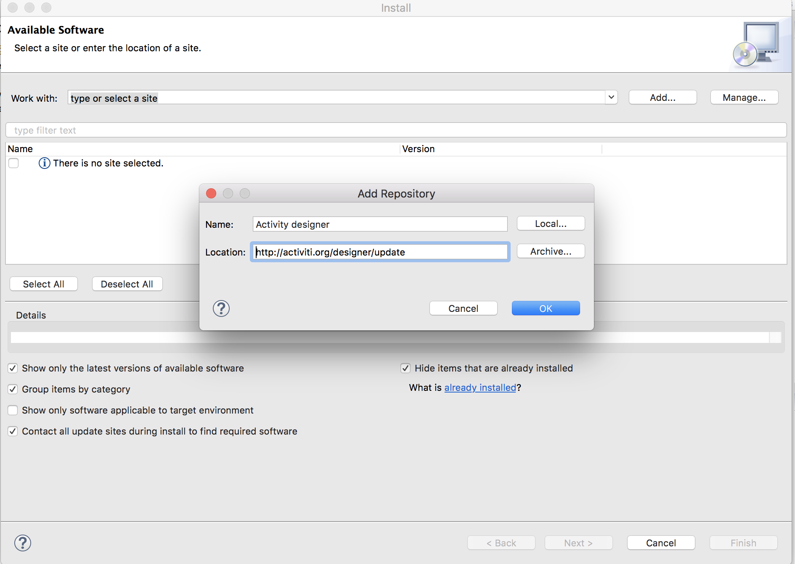
.. Select the checkbox [navy]#**‘Activiti BPMN Designer’ **# and click [navy]#** Next **#
+
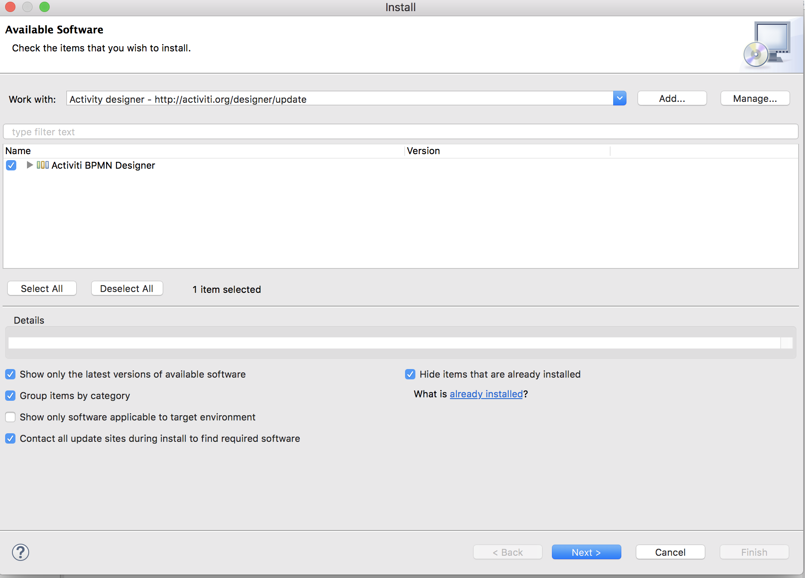
.. Review the item and click [navy]#** Next **#
+
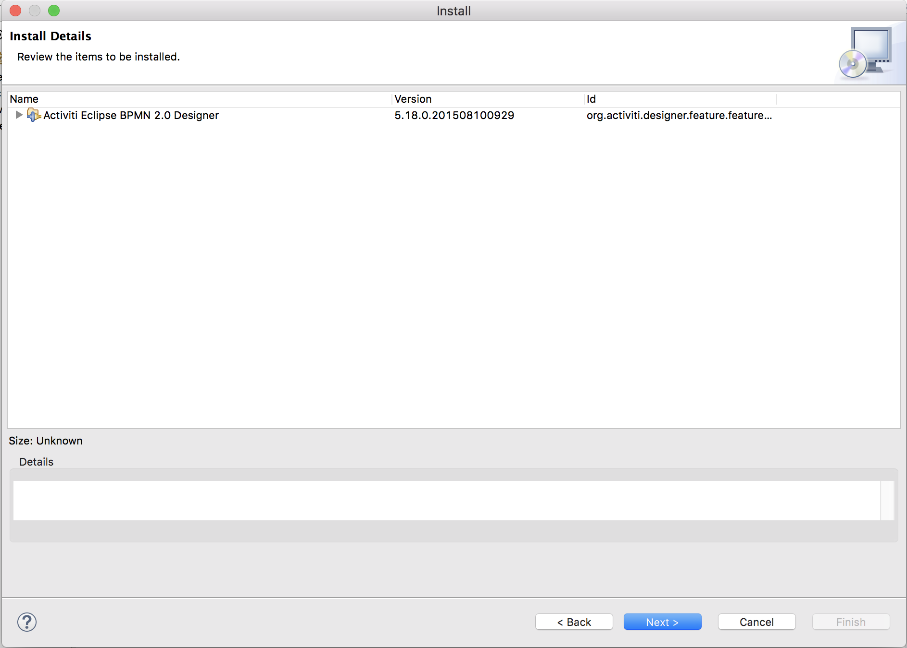

.. Accept the license agreement and click [navy]#**Finish **#
+
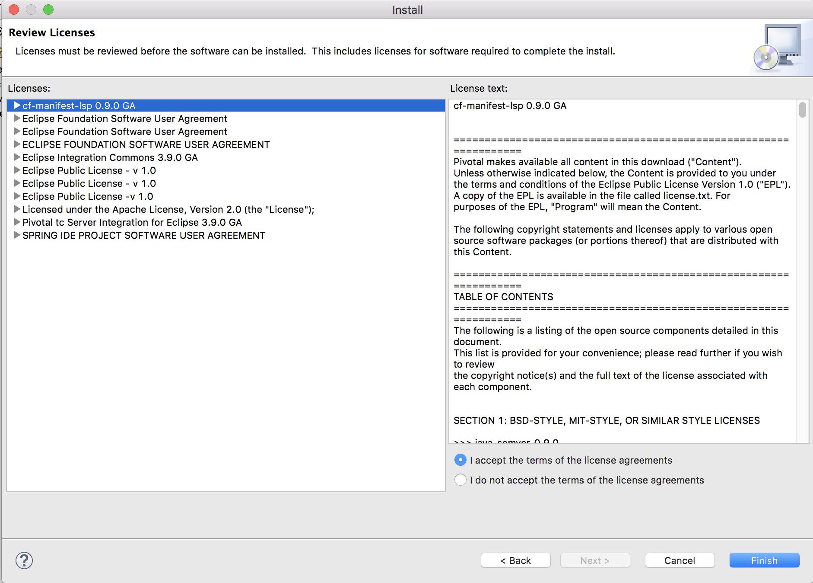

.. You will get a Security Warning .Click [navy]#** Install anyway**#
+
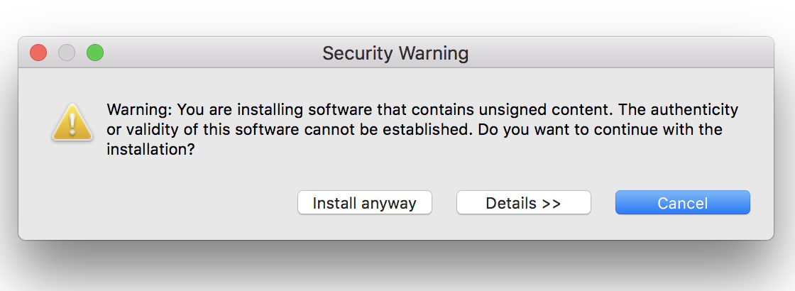
.. Once installed, we will get a restart STS prompt and click on [navy]#** Restart Now **#
+
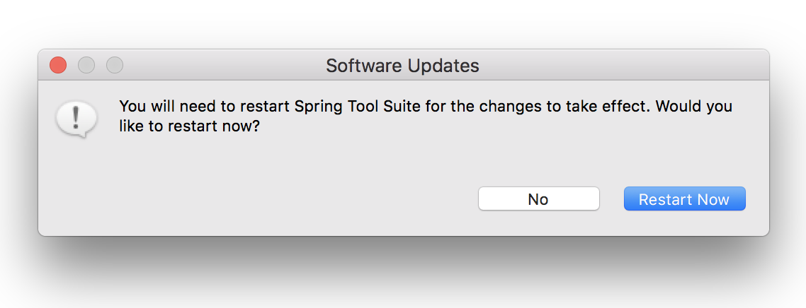

==== Installation of Robo 3T ( DB Client)

..	Go to https://robomongo.org/ and click Download Robo 3T
+
image::R1.png[R1]

.. Click [navy]#**Download  Robo 3T**#
+
image::R2.png[R2]

.. Choose the appropriate OS and click on the dmg 
+
image::R3.png[R3]

.. Open the downloaded dmg file . Drag and drop Robo 3T to [blue]#** "Applications" **# folder 
+
image::R4.png[R4]

.. Open Robo 3T and accept the user agreement. Click [navy]#**Next**#
+
image::R5.png[R5]

.. Click  [navy]#**Create**#
+
image::R6.png[R6]

.. Create a new **Local** Connection Local and click [navy]#**Save**# 
+
image::R7.png[R7]
.. Click [navy]#** Connect**# to establish connection with DB
+
image::R8.png[R8]

== Working with MongoDB through Docker

. Go to :
[blue]#** https://bitbucket.anthem.com/projects/NIM/repos/nimbus/browse?at=refs%2Fheads%2Fdevelop **# and click on [navy]#** clone **#

+
image::md1.png[MD] 

. Copy the link
+
image::md2.png[MD] 

. Create a temporary folder on the Desktop named [blue]#**"Temp"**#
. Open terminal, go to the Temp location and paste the following command 
+
[subs="quotes"]
-----------------------------------
*git clone -b develop https://AF12345@bitbucket.anthem.com/scm/nim/nimbus.git*
----------------------------------- 
. We will get the cloning to ‘nimbus’  message on the terminal. We are doing this activity to get the script file which is required to pull the docker images.
+
image::md3.png[MD] 

. Once we are done with cloning, let’s check the contents by going to [blue]#** "nimbus" **# folder and listing the files in it
+
[subs="quotes"]
-----------------------------------
*LC02WN0NMHTDD:Temp AF12345$ cd nimbus/
LC02WN0NMHTDD:Temp AF12345$ ls*
-----------------------------------

. Let’s pull the docker images using the sh dev command
+
[subs="quotes"]
-----------------------------------
*sh dev-script-p-dep-all-start.sh*
-----------------------------------
. The script will run with successful output on the terminal
+
image::md4.png[MD] 

. Now we can delete the [blue]#** "Temp"**# folder.
Go to [navy]#** Kitematic**# in [navy]#** Docker**#
+
image::md5.png[MD,300] 
. 	Select [navy]#**mongo**#  and click [navy]#**Start**#
+
image::md6.png[MD] 

== Certificates Required for Development

. Download the mentioned certificates:
 
.. *http://pki.wellpoint.com/pki/RootCA_WellPoint%20Internal%20Root%20CA.crt*
..	 *http://pki.wellpoint.com/pki/MOM9P70123.us.ad.wellpoint.com_WellPoint%20Internal%20Issuing%20CA%202.crt*
.. *http://pki.wellpoint.com/pki/VA10P70803.us.ad.wellpoint.com_WellPoint%20Internal%20Issuing%20CA%201.crt* 

. These files be saved as follows in your [blue]#**"/Downloads"**# folder:

..	*RootCA_WellPoint Internal Root CA.crt*
..	*MOM9P70123.us.ad.wellpoint.com_WellPoint Internal Issuing CA 2.crt*
..	*VA10P70803.us.ad.wellpoint.com_WellPoint Internal Issuing CA 1.crt*

. Rename the extensions from “.crt” to “.der” and replace the spaces with underscore 
Example:
*RootCA_WellPoint Internal Root CA.der should be changed as  RootCA_WellPoint_Internal_Root_CA.der* 
. Copy these certificates to [blue]#** "/tmp" **# folder by running  the command [navy]#**cp *.der /tmp **# in   terminal
.   Run these in your command line to add the certificates to your keychain

.. [navy]#**sudo keytool -import -alias “RootCA_WellPoint_Internal_Root_CA” -storepass changeit -keystore $JAVA_HOME/jre/lib/security/cacerts -file /tmp/RootCA_WellPoint_Internal_Root_CA.der**#
.. [navy]#** sudo keytool -import -alias MOM9P70123.us.ad.wellpoint.com_WellPoint_Internal_Issuing_CA_2 -storepass changeit -keystore $JAVA_HOME/jre/lib/security/cacerts -file /tmp/MOM9P70123.us.ad.wellpoint.com_WellPoint_Internal_Issuing_CA_2.der
**#
.. [navy]#** sudo keytool -import -alias VA10P70803.us.ad.wellpoint.com_WellPoint_Internal_Issuing_CA_1 -storepass changeit -keystore $JAVA_HOME/jre/lib/security/cacerts -file /tmp/VA10P70803.us.ad.wellpoint.com_WellPoint_Internal_Issuing_CA_1.der
**#

== Conclusion
Your are all set!
Have a happy coding !

