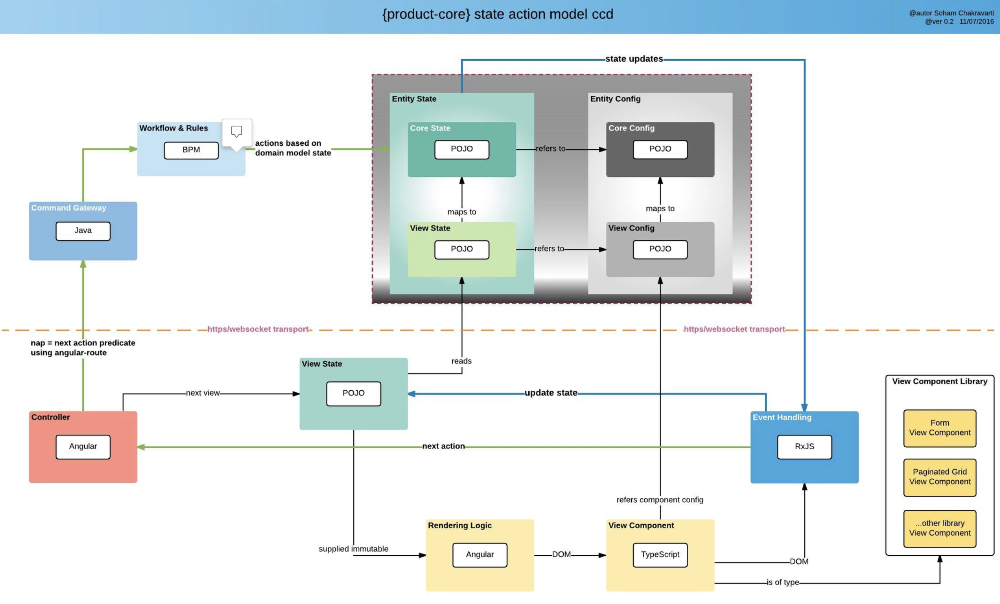

=== Overview

Nimbus framework is a **Business Process Management tool** which is used to create **scalable** applications easily and quickly

* The framework is built using spring boot, spring cloud & Angular and it uses command design pattern internally. 
* The framework helps to create  **"Low code-open source-workf-flow driven applications"** 
* We have the freedom to leverage the framework and build applicaitons easily. It is the ** configuration capability** of the framework which enables us to build different applications.
* Nimbus framework is **domain agnostic** i.e., the framework does not really care about the type of application we are creating. It can be clinical, financial or something else. 
* It gives you all development tools for easy and scalable applications. 
* The framework provides some of built in process modelling tools & rule writing tools to build **workflow driven business applications** quickly.

image::RF1.png[RF1]

Quad Model:

image::RF7.png[RF7]

image::RF4.png[RF4]
image::RF3.png[RF3]

=== Usability of the framework
With the help of this framework, we can create a HelloWorld application, PetClinic application or any other application. It is the framework’s configuration capability which enables us to build different applications.
This diagram explains e
image::structure.png[structure]

=== Framework Overview and Architecture
Please click on the link below to see an overview and architecure of Nimbus.

