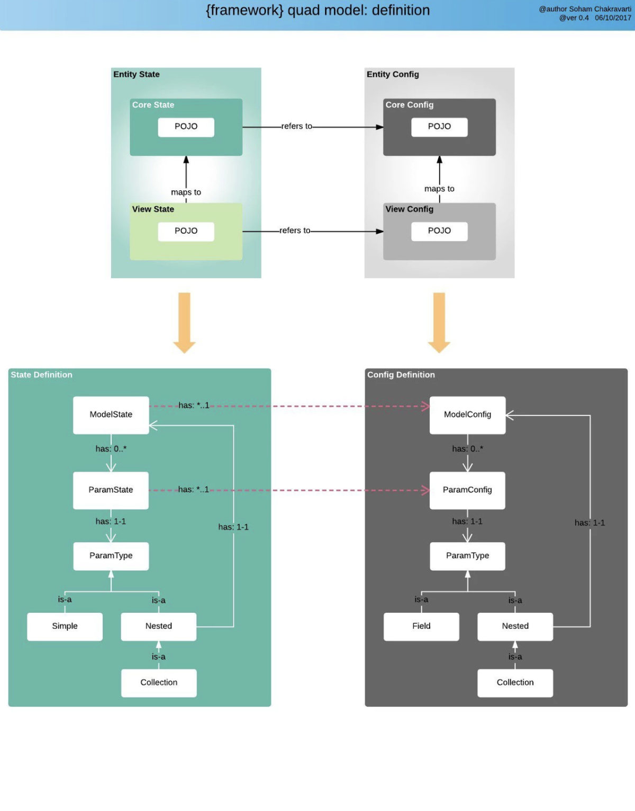

= NIMBUS FRAMEWORK BOOTCAMP TRAINING- MODULE 2
:docinfo: shared,private-head
:revnumber: v1.1
:revdate: 8.10.2018
:revremark: First draft
:source-highlighter: prettify
:sectnums:                                                          
:toc: left                                                             
:toclevels: 4                                                       
:toc-title: Table of Contents                                              
:experimental:                                                      
:description: NIMBUS AsciiDoc document                             
:keywords: AsciiDoc  

[.text-center]
[big navy]*MODULE 2*
[.text-center]
[big navy]*OVERVIEW OF NIMBUS FRAMEWORK*

=== Introduction

This module helps to understand the architecture of NIMBUS framework

=== Audience
Anyone who needs to understand the architecture of the framework

=== Outline

Nimbus framework is a **Business Process Management tool** which is used to create **scalable** applications easily and quickly

image::RFA1.png[RFA,600]

* The framework is built using spring boot, spring cloud & Angular and it uses command design pattern. 
* The framework helps to create  **"Open source applications(using less code)"** 
* We have the freedom to leverage the framework and build applicaitons easily. It is the ** configuration capability** of the framework which enables us to build different applications.
* Nimbus framework is **domain agnostic** i.e., the framework does not really care about the type of application we are creating. It can be clinical, financial or something else. 
* It gives you all development tools for easy and scalable applications. 
* The framework provides some of built in process modelling tools & rule writing tools to build **workflow driven business applications** quickly.

=== Thought process of the framework

image::RF1.png[RF1]

==== Domain Model:

For any application, the first step in the process of building the product is to define the business entities i.e., the domain model   
   +
      
* The Domain model is the core of our framework
* This framework is based on domain driven development
* We will define the Domain first and then we will work around it.

==== Config:

* This framework enables us to create Low-code configuration-based applications. Config explains how to define the entity and how the entity is modified using *rules* and *workflows*
* Once we have the domain model, we can define the configuration for the view, workflow and the rules
+
*Entity Config:* Defines the provider entity
+
*Rules Config:* Defines rules that act on the provider entity
+
*Workflow Config:* Defines workflows that act on provider entity

==== State:

The value of each entity and its corresponding attributes is referred to as state in the framework. 

Ex: Consider a patient portal. Every patient has a case associated with him/her in the system.

* *Entity state:* An entity gets a state during runtime depending on the input values/actions from the user. The following actions can happen on the entity state. 
+
** *Persistence:* Persistence is done by storing the state in the database
+
** *Caching:* Caching is done to improve the performance
+
** *Events:* Events occurs based on some actions
+
** *Notifications:* Events trigger notifications  
+
Example: Consider the status of a patient's case was 'In Progress'. When the status is changed to 'Approved', an email should be sent to the provider or the corresponding member 
+
** *Changelog:* Changelog logs the change of the entity's state
+
Example:The value of patient's case status was 'In Progess'.Now the value is changed to 'Approved'. All the changes would be logged. 

* *Audit:* An entity state's audit provides the history of changes that happened on an entity attribute when enabled. Changes may include details like who changed the state of an Entity or when did they change the state etc.
+
Example: When was the value of patient's case status changed to 'Approved' and by whom.
* *Process state:*
+
** Saving the state of an entity even after the process has been completed for further processes.
** Example:
Consider we have an application which has 5 steps to execute. On day 1, you were able to complete the first 3 steps with the provided user data. On day 2 ,you have to execute from step 4. We along with our business process should know from where should we continue. This information is got from the saved state till step 3.This is called as the business process state and persisting the state . 

==== Command:
* The instruction that the framework understands to execute and produce an output 
* Similar to the traditional method calls for button click to do some business logic
*  A standardized the process of writing instructions in way that is understood by the framework and acts on the  domain  

==== Version:
* Specifies the version of the Domain
* There could be multiple versions for a Domain. 
* Creates and manages multiple releases of a Domain

Example: Consider we have a first release with a version 1.0 in production. Now  if we make some additional changes, we may need to have a new release with a different version say, 1.1 which is backward compatible. 
  

==== Summary of the thought process:
Config defines the domain, state tell us the state of the domain at a given instance and commands act on a domain

=== Quad Model:
** The thought process of the framework is achieved with the help of Quad Model
** Quad model refers to **Core Config**, **View Config**, **Core State**, **View State** 

Let us divide the diagram into two blocks.  

==== Upper Block

===== Entity Config 

Let us understand this with the help of a Provider example. 

**(a) Core Config definition:**

** The pure definition of a provider is given by core config.
** In the form where we are entering the data, we may capture first name, last name and tax id of the provider and not everything. 
+
Example: Core Config gives Name, Address and TaxId etc. of your provider domain.

**(b) View Config definition:**

** Requirements are different for view. 
** The View Config can be used capture only limited(needed) data of the Core (Provider)
** The View Config maps to the Core Config.
** Based on one core definition we can create multiple view definitions. This is because the provider being used would be different in different places but the definition of the provider does not change
** There are multiple ways to view providers as well. This can either be requesting providers or servicing providers

Thus, we have seen the definition of the provider in terms of core and view

===== Entity State

** State is the value of the provider object at the given instance or in a session.
** When an application is running, the user may enter data. We have a state when we start capturing data about the provider.
** As you know, we have core and view for configuration. Likewise, we have core and view for state as well.
** Example: 
.. In our application, consider we open a provider-finder page and search for a provider. In the result page you would like to see only relevant details like the first page u may want to see only the provider name, address and specialty.This is one view of the provider.
.. Consider we have a button 'View Details' in the same provider-finder page. Once you click that button, we can see more provider details say affiliations, visiting office locations etc. This is another view for the same provider.
** On the top you have the **Core State** which is the entire state of the provider 
** We can have one or more **View States** depending on what we are displaying to the user. 
** So, it's the same core state of the provider with multiple view states. 
** This is the main idea of the entire framework. 

==== Lower Block

** This block explains the class hierarchy diagram. 
** This is maintained internally by **Model Config, Param Config, ParamType field, Nested and Collection**.
** Consider our provider as **Model**. Under provider we can have multiple **parameters** like First Name, Last Name, Address etc. The parameters can be of type **Simple fields**(First Name, Last Name) or **Nested**(Address). The Nested type can also be a **Collection**  where we can have phone numbers, one or more addresses. Address is a type Collection which is of type Nested.

== State Action Model

This is the class diagram of how things are maintained within the framework.

image::RF2.png[RF7]

** Nimbus framework follows **State Action Model** architectural pattern 
** Quad model is on the server side and Angular is used on the front-end
** Let us split the diagram into 2 blocks based on the orange dotted line
** Upper part represents server and Lower part represents front end
** Flow of the framework: **UI-->Server-->UI**
* Whenever UI interactions happen, the corresponding configs are executed through Command Gateway. Then the Command Gateway will trigger Workflow and Rules. When there is a State change, UI will be informed/notified and Angular will update the components accordingly

==== Lower Block

**Front end:**

** Note the blue line that goes from Entity State( Upper Block) to Event Handling(Lower Block)
** Whenever the state changes, the UI should be notified of the same and we have to provide new information to the user. 
** For every action and state change, server will send 'state change notification' to the front end
** Front end handles the events through **RxJS**
** We know that '**RxJS** code involves making subscriptions to observables' 
** **RxJS** constantly subscribes to events and whenever it receives a subscription or an event change, it will notify the front-end components and they will update themselves
**  Whenever an event happens, **RxJS** comes to the event handler which listens to all the changes. 
** As soon as **RxJS** get an event, it will update **View State**
** **View State:** This is what the users see
** **View State** in the front-end matches the state maintained by the server(both will have modified data) 
** The **View State** in the server maintains the View State in frontend
** Server acts as the reference 
* Example:
..  The front end gets an event saying that the case status is changed
.. Now ,what could be the new value of the status?
.. Front end will go and get the value from the Server's **View State** and  will display the new value 'Approved'.

** **next action** explains what the user is supposed to do next
* Example: Go to new page, click button etc.
** **next view:** For every triggered action, you will be directed to **next view**.
* Example : You enter a new provider's details and submit. Once done, you can view the provider's page, which displays a list of providers along with the latest.
** From the **Controller(Angular)**, the **next view** is going to **View State** 
** Whenever an event occurs, **next action** goes to **Controller(Angular)** , which calls the **Command Gateway** in the server
** Based on that event, **Workflows and rules** changes the state.
** The server acts and instructs to display the next page.
** The next page is a completely different view
** The view get refreshed on the front end
** Core UI is Angular(**Rendering Logic**) with Typescript(** View Components**)
** **View Component Library** has multiple view components 
* Example: Form, Grid, Tile, Textbox, Accordion etc.
** **supplied immutable** indicates that the state of the variable cannot be changed by the UI and is controlled  and changed by the server. 

==== Upper Block

**Workflow & Rules:**

Workflows and rules change the state. 

** Whenever a user-action happens like a button click, it can trigger a work flow or a rule  
** When these workflows and rule execute, the state changes.
** Example:
.. Consider a rule that if the provider code is 1234, the status of case should be approved. 
.. So, if a user entered 1234 as the provider code, the above rule will be executed and the status of the case would be set as approved. 
.. Here the state is changed based on a rule. 

**Command Gateway:**

Command Gateways are multiple actions that come from the frontend. 

** Example:
.. Consider a basic UI operation or a CRUD operation.
.. We can add a provider, delete a provider, update a provider or view a provider. That is, we can create, read, update and delete a provider 
.. Any of these actions can happen to entities
** When an action happens, all the commands go through the Command Gateway
** Front end user does some actions and front-end code sends those commands to server 
** Server in the command gateway will interpret those commands and might trigger work flows rules or straight update the state in the database. 
** We have our own **Command Query Domain Specific Language** to serve the purpose
** **Command Query Domain Specific Language:** The  **Command**  is  the  instruction  that  the  Framework  understands  to  execute  and  come  back  with an output. It is similar to writing the traditional method calls for an action (such as a button click)to perform business logic, but attempts to introduce a standardized process via the use of a domain specific language (DSL) that the Framework can interpret. This is called the **Command Query DSL**.The  Command  Query  DSL  is  represented  in  URL  format  (commonly  referred  to  as  the  Command URL) and is based on Query DSL.

=== QUERY DSL:

* Commands acts on domain which instructs how to behave 
+
** Create: Create new provider
** Read: To retrieve the data 
** Update: To update the data
** Delete: To delete the data
image::RF3.png[RF3]
* Please visit the link below to get more clarity on QUERY DSL
[blue]#** https://confluence.anthem.com/pages/viewpage.action?spaceKey=NIM&title=Framework+Reference+Documentation&preview=/208749944/230400439/1.1.5.BUILD-SNAPSHOT.pdf **#

* Look for **Chapter 3: The Command Query DSL, Page 18**

=== TECH stacks:

These are the technologies that we are using in the framework.

image::RF4.png[RF4]

=== Usability of Nimbus framework
With the help of Nimbus framework, we can create basic HelloWorld application, PetClinic application or any other application. It is the framework’s configuration capability which enables us to build different applications.

image::structure.png[structure]

