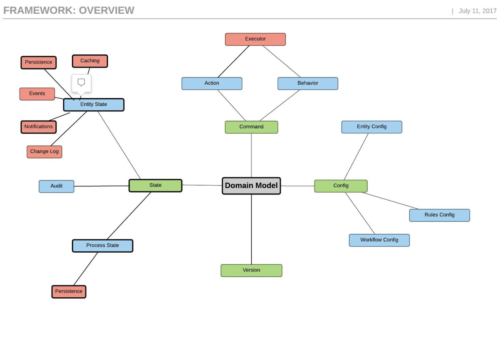
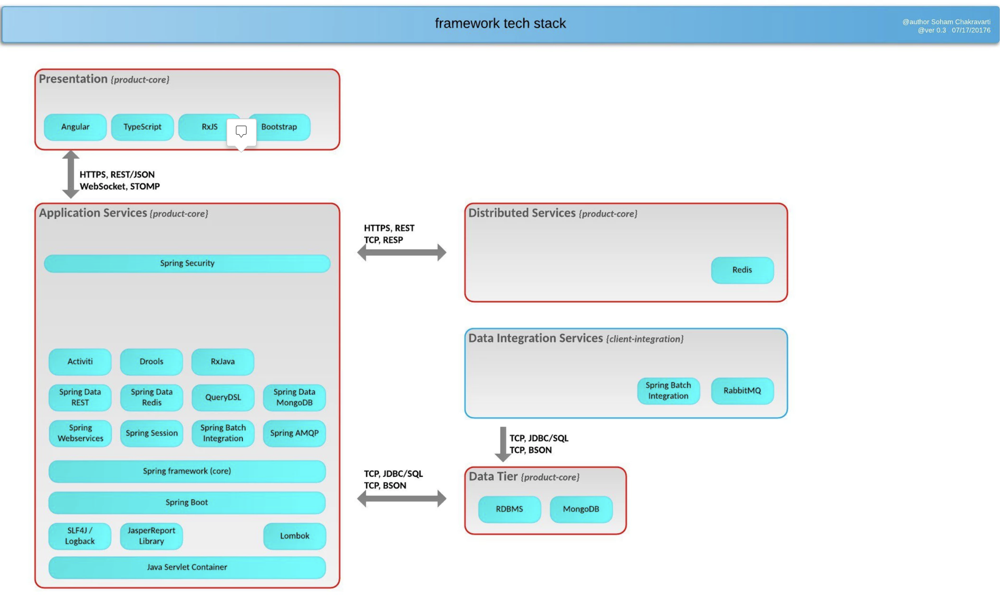

=== Overview

Nimbus framework is a **Business Process Management tool** which is used to create **scalable** applications easily and quickly

image::RFA1.png[RFA,400]

* The framework is built using spring boot, spring cloud & Angular and it uses command design pattern internally. 
* The framework helps to create  **"Low code and open source applications"** 
* We have the freedom to leverage the framework and build applicaitons easily. It is the ** configuration capability** of the framework which enables us to build different applications.
* Nimbus framework is **domain agnostic** i.e., the framework does not really care about the type of application we are creating. It can be clinical, financial or something else. 
* It gives you all development tools for easy and scalable applications. 
* The framework provides some of built in process modelling tools & rule writing tools to build **workflow driven business applications** quickly.

=== Thought process of the framework

==== Domain Model:

For any application, the first step in the process of building the product is to define the business entities i.e., the domain model   
   +
      
* The Domain model is the core of our framework
* This framework is based on domain driven development
* We will define the Domain first and then we will work around it.
* Domain specifies the Core Provider defintion

==== Config:

* This framework enables us to create Low-code configuration based applications. Config explains how to define the entity and how the entity is modified using *rules* and *workflows*
* Once we have the domain model, we can define the configuration for the view, workflow and the rules
+
*Entity Config:* Defines the provider entity
+
*Rules Config:* Defines rules that act on the provider entity
+
*Workflow Config:* Defines worflows that act on provider entity

==== State:

The value of each entity and its corresponding attributes is referred to as state in the framework. .

* *Entity state:* An entity gets a state during runtime depending on the input values from the user. The following actions can happen on the entity state. 
+
** *Persisitence:* Persistance is done by storing the state in the database
+
** *Caching:* Caching is done to improve the performance.
+
** *Events:* Events occurs based on some actions.
+
** *Notifications:* Events trigger notifications.  
+
Example: If the status of a case is 'Approved', an email should be sent to the provider or the corresponding member. 

+
** *Changelog:* Changelog logs the change of the entity's state.
+
Example: Previously the case status value was 'In Progess'.Now the value is changed to 'Approved' 

* *Audit:* An entitiy state's audit provides the history of changes that happened on an entity attribute when enabled. Changes may include details like who changed the state of an Entity or when did they change the state etc.

* *Process state:*
Let us understand this with an example:
Consider you have an application where in you have 5 steps to execute. As on Day 1, you were able to complete only first 3 steps with the provided user data. As on Day 2 you have to execute from step 4. How do we know the state of the business process?. We need to know from where should we conitue.We have to know how much business process is executed so that we can continue from there.
So we have to save to save whatever done till Step 3 . This is called as the business process state and persisting the state .

=== Command:
* The instruction that the framework understands to execute and produce an output. 
* Similar to the traditional method calls for button click to do some business logic
*  A standardized the process of writing instructions in way that is understood by the framweork and acts on the  domain  

=== Version:
* Specifies the version of the Domain
* There could be multilple versions for a Domain. 

example , first release was in to production that is 1.0, say there could be come addoitional changes, a new version came accodmotaing the changes. but if something is already saved with 1.0, then 1.1 should be backward compatable. there should be some version ing that happens. becoz the domain defention can change from releease to other.

[[[[i need to know how much business process is executed so that i can continue from there. there was an error, then we would know ok this is the place where i need to start over from. so that is the state of the business process itself. and that also needs to be persisted;
today if my applicaitons have 5 steps, today i can do 2 steps and sign of of the day.tmrw wen i come and start, i should know that i have to start from 3rd step. 
my business process should also start from 3rd step. what happend upto that point,we have to save. that is the business process state and the persistnce of the state.]]]]

[we are doing domain driven development.
menaing we first define our domain and then see what goes around it. 
so in the centre we have defined domain which the core provider defenition

how do you do thst provider defenition that is the configuration ( on the irght side). How are we defining the provider is configuration.

what goewsn into the condiguration:-> entity config( which is definiting the provider itself), then we define rules that act on the provider entity and we also define worflow that act on provider entity.
we are doing development with confiration. we are not wirting lots of codes. so this config is defining everythings: that is how the entity is defined and how the entity is modified using rules and workflows.]

State:
at runtime depending on the values entered by the user, it has a state. now the state has to be audited( who changed it , when did they change it..these are audit information)

enity state: depending on enitty state there are somethings that need to happen. we have to persisit it, meaning  store the state in db, you might have to cache it to improve the performabce. we might have to send notifications or events depending on certain values. for eg, if the case is approved, we might have to send an email to the provider or the member. some event gets trigered and that events can trigger notification.
changelog:previously value was in inprogess. now its approved. 
change log and audit are 2 different things.
change logs says the value changed from this to this.
audit : who changed / when changed

process state:
if you are looking at workfflow engines, say there are 5 steps. only first 3 are exectuted becoz we on;y have so much data or user have only entered this much data and the next time the user comes we have to execute form the 4th step.how do i know what is the state of the business process itself. i need to know how much business process is executed so that i can continue from there. there was an error, then we would know ok this is the place where i need to start over from. so that is the state of the business process itself. and that also needs to be persisted;
today if my applicaitons have 5 steps, today i can do 2 steps and sign of of the day.tmrw wen i come and start, i should know that i have to start from 3rd step. 
my business process should also start from 3rd step. what happend upto that point,we have to save. that is the business process state and the persistnce of the state.

version:
there could be multilple versions as we keep changing. example , first release was in to production that is 1.0, say there could be come addoitional changes, a new version came accodmotaing the changes. but if something is already saved with 1.0, then 1.1 should be backward compatable. there should be some version ing that happens. becoz the domain defention can change from releease to other.

there should be some commands which tells what needs to  happen
so the cmd is command DSL.. simple cmmds are i want to get( read) i want to update, delete or i want to create a new provider.these are different commands. so these commands acts on domain. the config defines the domain, state gives what is the state of the domain at a given isntance.

tjhis is the thought process. 
how are we acheiving this, we areacheinving this with quad model.the quad model acheives state and config. then we have query dsl which does command aaction behaviour part

Quad Model:

image::RF7.png[RF1]
Lets see in detail about top part of the diagram.
Lets take an example of a Provider to dive into the diagram
Core Config:
Core Config gives you the pure definition such as Name, Address and TaxId etc of your provider domain.

Now we have the provider defined. This provider can be used in multiple ways. For eg. i might create a form to enter provider data.
So when i am entering provider data, you know what from my procedure there could be a requesting provider and there could be a servicing provider.
Requesting provider is if we go to a primary physician. He will check up and say we need to get this procedure from this speciaist. so go to this orovider who is going to service the request. we have 2 providers. reuqesting providers and servicing providers

In the form where we are entering the data, we might not capture everything. We are not going to enter speciality of the privdierfor eg. we will just enter first name lastname and tax id of the provider

For view, requirements are different,i need to capture requesting provider and we may need to cpature servicing provider. both are of type provider and io am capturing limited data for those providers like what is needed. that is my view definition.my view maps to the core.i am looking at the core i have a servicing provider of type provider and i am only capturing 4 or 5 attributes. now what have we done. we have one core definition and based on the core definition we are creating mulitple view definiitions.
becoz the way provider is being used is going to be difeerent in different places. but the definition of the provider doesnot change.
thats the difference between the core and the view.
SO far we have seen the deficniton of the provider in terms of core and view.
Now when the application is running the user is entering data. So once we start capturing data about the provider, now we have a state.
State is what is the value of the provider object at the given instance or in a asesison. thats the state.
just like how you have the core and view for the configuration, we will have core and view for the state too.
example: i could go and get the entire provider definition that has all the details about the provider but when i am displaying it , if i am displaying it to the member, member just needs to know..valid details 
for example: if you are opeining a porivder finder and you are searching for a provider, the first page u may want to see only the provider name adress and specillaity. thats one view of the provider
now say we can click on some button called view details, then we can see more details about the provider like affiliations what are all the facilities he goes to, whaat are his locations(more info). this is an other view for the same provider.
on the top you have the core state, that is the entire state of the provider. and in the bottom you can have one or more view states depending on what i am displaying to the user. SO its the same core state of the provider with multiple view states. thats main idea of the entire framework. this is called quad model core config, view config, core state view state. view maps to core and state will refer to the configuration.
the bottom is the class heirchy diagram. how this is maintainted internally. You have model config, param config, paramtype field, nested n collection.
wwe have a model i.e., provider. Under provider i have multiple parameters.i have name address etc. the parameters can be of type fies(name) or nested(address). meaning first name , last name etc are fields. address is nested( which has field) or which can alosj be a collection where we cna have phone numbers, one or more addresses. Address is a type collection which is of type nested.

class diagram of how things are maintained withinthe framwework.

just take those 2 boxes from the top

== State action model:
image::RF2.png[RF7]

mvc a pattern which shows how the front end backend and database ar4e presented. so we are following state action model. we talked about quad model. Quad model is on the server sideamd then you have a front end which the user sees which is in angular.
top is the server bottom is the front end9 above orange line server below fonrt end).
top, on the left we can see work flow and rules:which syas that we have workflows and rules which change the state. whenever there is an user action that happens say for eg a buttion click or UI action, it can trigger a differnt work flow or it can trigger a rule based on what he entered. Now,when these workflows and rule execute, it is going to change the state.For example  if the provider code is 1234,then the case is approved.so the user entered 1234 the rule got executed and set the status of the case as approved. SO the state changed based on the rule. there are workflows and rules tat act on a state and change the state.now what truggers the workfloew?->the command getway. what is a command gateway? these are mutliple actions come from the frontend. eg take CRUD oprn, take basic UI. We are adding a provider deleteing a provider, updating a provider..Create read update delete. any of these actions can happen to any of the entities. when that happens, all the commands go through the command gateway.We have our own  command DSL.
User is doing some actions & frontend code is sending those commands to server. Server in the command gateway will interpret that ( that means it will know what to do) and might trigger work flows rules or stright update the state in the database. that is called command gateway.So server is done.

Front end:( blue line that goes from entity state to even t handling)
any time the state changes, the UI shoudl know that something has changed.Becoz we need to provide the new information to the user. so anytime some action happens and state changes, server will immedietely send state change to the friont end. in the front end, the way we handle state changes is we have something called RXJs.that handles the events.basically it gives something like a subscriber. it constlanly subscribes to events and anytime it geta subscrption or an event change, it will notify the front componenets and they will updtae themeselves. Whenever an event happens, this comes to the event handleer which listens to all the changes. as soon as it get an event , its going and updating the view state. BView state is what the users see.view state on the top is matching state the server maintains.(both will have modified data). The view state in the server maintains the view state in frotend. server is the referrence. the fornt end syas oh i got an event, it says something changed i.e., this parameter changed. so what is thr new value of the paramenter. so its going and getiing the value from the server view state and displaying.the event updates are like this. 

example:; case status changed:
server is sending an event saying that status changed then ui ask wats the new status now? approve. ok i will show approve.

next action:exaplins wats the user suppose to do next. like go to the next action like go to new page, click button or something. all these actions keeps going. with every action that gets triggered, for example submit provider details..thats the action. when this action happens, we are going to another view.when i enter providers, its going to show me the list of providers. so thats the next view. from the controller the next view is going to view state. there was an action, action went to angular controller, which calls the commmand gateway in the serfver. the server id something and syas go to the next page.the next page is the complete different view. the view refreshes on front emd.
in the bottom you can see that we are using angular with typescript. thats the core UI. and that has view components and there are mulitple view components. (library).. we have many viewscom..form gird tile textbox accordion..there are many compomnets . this says the view components are one of these types.
immutable: we cannot change the state of the variable. its controlled by the server. 

state says: just what the state is
but there should be some logiv oin the front end , that knows they have to read this in front end, that know what comps to render. all these ar 3in yellow box.

view state is what users see.but for that to happen, there is some code written in the background, there is some view componets. thats in the bottom

eg :which sows difference b/w core n view

QUERY DSL:

TECH stacks:

these are the technologies that we are using in the framework.

=== Usability of the framework
With the help of this framework, we can create a HelloWorld application, PetClinic application or any other application. It is the framework’s configuration capability which enables us to build different applications.
This diagram explains e
image::structure.png[structure]

=== Framework Overview and Architecture
Please click on the link below to see an overview and architecure of Nimbus.

