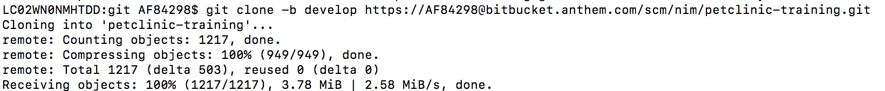

= NIMBUS FRAMEWORK BOOTCAMP TRAINING- MODULE 4
:docinfo: shared,private-head
:revnumber: v1.1
:revdate: 8.10.2018
:revremark: First draft
:source-highlighter: prettify
:sectnums:                                                          
:toc: left                                                             
:toclevels: 4                                                       
:toc-title: Table of Contents                                              
:experimental:                                                      
:description: NIMBUS AsciiDoc document 4                            
:keywords: AsciiDoc  

[.text-center]
[big navy]*MODULE 4*
[.text-center]
[big navy]*AN INSIGHT TO PETCLININC APPLICATION*

=== Introduction

This module helps to get an insight on petclinic application and how to play around with it

=== Cloning Pet-Clinic Code

.. Login to: [blue]#**https://bitbucket.anthem.com/projects/NIM/repos/petclinic-training/browse?at=refs%2Fheads%2Fdevelop **#
..	Click [navy]#**clone **# and copy the hyperlink
[blue]#** https://AF84298@bitbucket.anthem.com/scm/nim/petclinic-training.git **#
..	Open Terminal 
..	Navigate to the git folder path and run the following command
+
[subs="quotes"]
-----------------------------------
*git clone -b develop https://AF84298@bitbucket.anthem.com/scm/nim/petclinic-training.git*
-----------------------------------
.. Terminal displays successful message
+

.. Make sure your mongo db is running
.. Import com.anthem.client.extension.petclinic and petclinic-web in STS 
+
image::PT2.png[PT2]
.. Build the project
+
image::PT3.png[PT4]
.. Run the application
+
image::PT5.png[PT5]
.. Select the application as 
+
image::PT6.png[PT6]
.. Launch the app by visiting [blue]#** http://localhost:8082/petclinic/login **# 
+
image::PT7.png[PT7]
