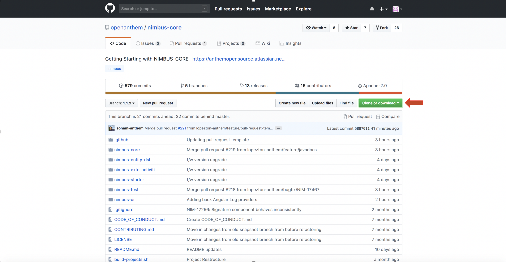
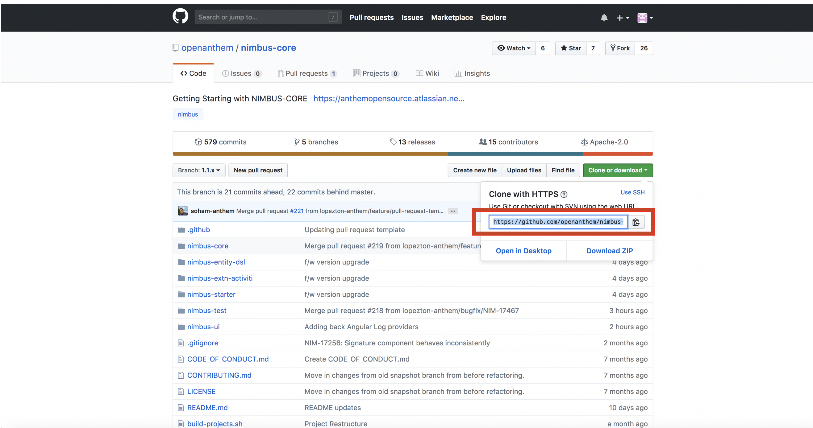
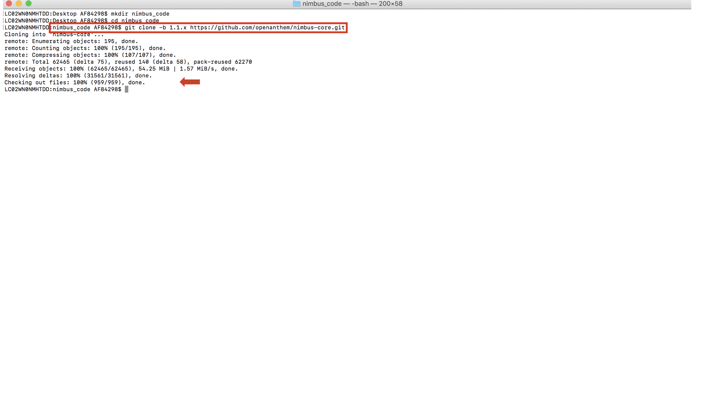

= NIMBUS FRAMEWORK BOOTCAMP TRAINING- MODULE 4
:docinfo: shared,private-head
:revnumber: v1.1
:revdate: 8.10.2018
:revremark: First draft
:source-highlighter: prettify
:sectnums:                                                          
:toc: left                                                             
:toclevels: 4                                                       
:toc-title: Table of Contents                                              
:experimental:                                                      
:description: NIMBUS AsciiDoc document 4                            
:keywords: AsciiDoc  

[.text-center]
[big navy]*MODULE 4*
[.text-center]
[big navy]*AN INSIGHT TO PETCLININC APPLICATION*

=== Introduction

This module helps you to create simple examples using NIMBUS framework

=== Audience

Programmers who have successfully set up the development environment for NIMBUS framework.

=== Pre-requisites

The developers are expected to have all the softwares mentioned below installed on their system

[cols="2",options="header"]
|=========================================================
|Application Name | Version 

|Java	|1.8.0_171 
|Maven	 |3.5.3
|Lombok	|1.18.2
|STS	|3.9.5 RELEASE 
|VS Code	|1.14.2 
|Robo 3T	|1.2.1
|Chrome	|Version 63.0.3239.108 (Official Build) (64-bit)
|Advanced Rest Client	|arc-12.1.4

|=========================================================

NOTE: Above s/w versions are compatible with Nimbus f/w version    **1.1.x**.
      The versions are subjected to change.

=== Cloning Nimbus Framework Code

take the latest nimbus odss code from github:

.  Go to 
[blue]#**https://github.com/openanthem/nimbus-core**# and select Branch as [navy]#**1.1.x**#.
+
image::CL11.png[cl1]
.	Click the [navy]#** Clone or Download **# button
+

. Copy the hyperlink
[blue]#**
https://github.com/openanthem/nimbus-core.git**#

+

.	Open Terminal

.	Create any new folder in your Desktop
+
image::CL333.png[cl1]
.	Navigate to the folder
+
image::CL44.png[cl1] 
. Run the following command
+
[subs="quotes"]
-----------------------------------
**git clone -b 1.1.x 
https://github.com/openanthem/nimbus-core.git
** 
----------------------------------- 
+

. Navigate to [navy]#**nimbus-core**# folder which resides in your new folder
+
image::CL66.png[cl1]
. Build the projects by typing the command
+
[subs="quotes"]
-----------------------------------
**sh build-projects.sh ** 
-----------------------------------
+
image::CL77.png[cl1]
. We are done cloning the framework code in our local folder

=== Cloning Pet-Clinic Code

. Login to: [blue]#**https://bitbucket.anthem.com/projects/NIM/repos/petclinic-training/browse?at=refs%2Fheads%2Fdevelop **#
+

.	Click [navy]#**clone **# and copy the hyperlink
[blue]#** https://AF84298@bitbucket.anthem.com/scm/nim/petclinic-training.git **#
+

.	Open Terminal 
.	Navigate to the git folder path and run the following command
+
[subs="quotes"]
-----------------------------------
*git clone -b develop https://AF84298@bitbucket.anthem.com/scm/nim/petclinic-training.git*
-----------------------------------
+

. Terminal displays successful message
. Make sure your mongo db is running
. Import [navy]#**com.anthem.client.extension.petclinic**# and [navy]#**petclinic-web**# in [navy]#**STS**# 
+
image::PT2.png[PT2]
. Build the project
+

. Run the application
+
image::PT5.png[PT5]
. Select the application as 
+

. Launch the app by visiting [blue]#** http://localhost:8082/petclinic/login **# 
+

== Playing around with Pet-Clinic App:

=== Adding a new Owner:
. Launch the app by visiting [blue]#** http://localhost:8082/petclinic/login **# 
+

.. Click Owners
+

.. You will be redirected to [green]#**Owners**# page
+

.. Click [green]#**Add Owner**#
+

.. You will be redirected to [green]#**Add Owners**# page
+

.. Enter the details
+

.. Click [green]#**Submit**#
+

.. You can view the details in [green]#**Owners**# page
+

=== Adding a new column:
. Launch the app by visiting [blue]#** http://localhost:8082/petclinic/login **# 
+

. Click [green]#**Owners**#
+

. You will be re-directed to Owners page. You can view the Owner details with  4 coloumns [green]#**First Name, Last Name, Owner City, Telephone**# . Let us try to display one more column [green]#**Zip Code**# in this page. Copy [green]#**vpOwner**# string from the url, as we are trying to search for the page that contains the column names to be displayed.
+

.  Goto [navy]#**STS**#, Click on [navy]#**Search--> File**#
+

. In [navy]#**File Search**# tab, type [green]#**vpOwner**# in [navy]#**Containing text**# textbox. Click [navy]#**Search**#
+

. You can see a list of files that contains [green]#**vpOwner**#
+

. There are 2 classes where we have [green]#**vpOwner**# : [navy]#**VROwner**# and [navy]#**VROwnerLanding.java**#
+
image::C15.png[C11]
. Framework uses the convention of [green]#**'VP'**# to denote  a page.Let us open the class [navy]#**VROwnerLanding.java **# as we have [green]#**'VP'**#  in this class.
+

. We could see that [green]#**owners**# are of type [green]#**OwnerLineItem**#. 
+

. Find [navy]#**OwnerLineItem.java **# inside [navy]#** com.anthem.client.extension.petclinic->com.atlas.client.extension.petclininc.view->OwnerLineItem.java **#
+

. Open [navy]#**OwnerLineItem.java **# . You can see the columns names [green]#**First Name, Last Name, Owner City, Telephone**# which are displayed in the Owners page.
+

.  Lets add a piece of code to display [green]#** Zipcode **# as well
+

+
.**OwnerLineItem.java**
[source, java]
------------

package com.atlas.client.extension.petclinic.view;

import java.util.List;

import com.antheminc.oss.nimbus.domain.defn.Execution.Config;
import com.antheminc.oss.nimbus.domain.defn.MapsTo;
import com.antheminc.oss.nimbus.domain.defn.MapsTo.Path;
import com.antheminc.oss.nimbus.domain.defn.Model;
import com.antheminc.oss.nimbus.domain.defn.ViewConfig.Grid;
import com.antheminc.oss.nimbus.domain.defn.ViewConfig.GridColumn;
import com.antheminc.oss.nimbus.domain.defn.ViewConfig.GridRowBody;
import com.antheminc.oss.nimbus.domain.defn.ViewConfig.Link;
import com.antheminc.oss.nimbus.domain.defn.ViewConfig.LinkMenu;
import com.antheminc.oss.nimbus.domain.defn.extension.Content.Label;
import com.atlas.client.extension.petclinic.core.Owner;

import lombok.Getter;
import lombok.Setter;

@MapsTo.Type(Owner.class)
@Getter @Setter
public class OwnerLineItem {
 
	@GridColumn(hidden=true)
    @Path 
    private Long id;
 
    @Label("First Name")
    @GridColumn
    @Path
    private String firstName;
    
    @GridRowBody
    private ExpandedRowContent expandedRowContent;
    
    @Model @Getter @Setter
    public static class ExpandedRowContent {
    	
    	@Label("Pets")
    	@Grid(onLoad = true)
    	@Path(linked = false)
		@Config(url="<!#this!>.m/_process?fn=_set&url=/p/pet/_search?fn=example")
        private List<PetLineItemOwnerLanding> pets;
    }
 
    @Label("Last Name")
    @GridColumn
    @Path
    private String lastName;
 
    @Label("Owner City")
    @GridColumn
    @Path("city")
    private String ownerCity;
 
    @Label("Telephone")
    @GridColumn
    @Path
    private String telephone;   
   
   @Label("ZipCode")
    @GridColumn
    @Path
    private String zip;  
    
    @LinkMenu
    private VLMCaseItemLinks vlmCaseItemLinks;
   
    @Model @Getter @Setter
    public static class VLMCaseItemLinks {
        
    	@Label("Edit")
        @Link(imgSrc="edit.png")
    	@Config(url="/p/ownerview:<!/../id!>/_get")
    	private String edit;
     
    	@Label("Owner Info")
        @Link(imgSrc="task.svg")
    	@Config(url="/p/ownerview:<!/../id!>/_get")
        @Config(url="/p/ownerview:<!/../id!>/_nav?pageId=vpOwnerInfo")
        private String ownerInfo;

        }
        }

------------

. In [navy]#**OwnerLineItem.java **#  , you can see that this class is mapped to [navy]#**Owner.class**#
+

. Find [navy]#**Owner.java **# inside [navy]#** com.anthem.client.extension.petclinic->com.atlas.client.extension.petclininc.core->Owner.java **#
+

. Since [navy]#**Owner.java **# is a core class , you can see the declaration/representation of all columns in the database here.
+

. Launch the app by visiting [blue]#** http://localhost:8082/petclinic/login **# . Click [green]#**Owners**# and then click [green]#**Add Owner**#
+

. Enter the value for [green]#**Zipcode **# 

+

. Enter the details and click [green]#**Submit**#

+

. You can see the column [green]#**Zipcode**# and its value displayed

+

=== Adding a action 'delete' for each owner:
. Launch the app by visiting [blue]#** http://localhost:8082/petclinic/login **# 
+

. Click [green]#**Owners**#
+

. Click the action menu(arrows on the very right most end of each row). You can see [green]#**Edit**# and [green]#**Owner Info**#
+

. As in previous example,let us open the class [navy]#**VROwnerLanding.java **# 
+

. We could see that the instance [green]#**owners**# are of type [green]#**OwnerLineItem**#
+

. Find [navy]#**OwnerLineItem.java **# inside [navy]#** com.anthem.client.extension.petclinic->com.atlas.client.extension.petclininc.view->OwnerLineItem.java **#
+

. Open [navy]#**OwnerLineItem.java **# . You can see the lines of code for actions [green]#**'Edit' **# and [green]#** 'Owner Info' **#
+

. Let us add a piece of code to perform the action [green]#** 'Delete' **# in [navy]#**OwnerLineItem.java **# 
+
image::C2e.png[C11]
+
.**OwnerLineItem.java**
[source, java]
------------
package com.atlas.client.extension.petclinic.view;

import java.util.List;

import com.antheminc.oss.nimbus.domain.defn.Execution.Config;
import com.antheminc.oss.nimbus.domain.defn.MapsTo;
import com.antheminc.oss.nimbus.domain.defn.MapsTo.Path;
import com.antheminc.oss.nimbus.domain.defn.Model;
import com.antheminc.oss.nimbus.domain.defn.ViewConfig.Grid;
import com.antheminc.oss.nimbus.domain.defn.ViewConfig.GridColumn;
import com.antheminc.oss.nimbus.domain.defn.ViewConfig.GridRowBody;
import com.antheminc.oss.nimbus.domain.defn.ViewConfig.Link;
import com.antheminc.oss.nimbus.domain.defn.ViewConfig.LinkMenu;
import com.antheminc.oss.nimbus.domain.defn.extension.Content.Label;
import com.atlas.client.extension.petclinic.core.Owner;

import lombok.Getter;
import lombok.Setter;

@MapsTo.Type(Owner.class)
@Getter @Setter
public class OwnerLineItem {
 
	@GridColumn(hidden=true)
    @Path 
    private Long id;
 
    @Label("First Name")
    @GridColumn
    @Path
    private String firstName;
    
    @GridRowBody
    private ExpandedRowContent expandedRowContent;
    
    @Model @Getter @Setter
    public static class ExpandedRowContent {
    	
    	@Label("Pets")
    	@Grid(onLoad = true)
    	@Path(linked = false)
		@Config(url="<!#this!>.m/_process?fn=_set&url=/p/pet/_search?fn=example")
        private List<PetLineItemOwnerLanding> pets;
    }
 
    @Label("Last Name")
    @GridColumn
    @Path
    private String lastName;
 
    @Label("Owner City")
    @GridColumn
    @Path("city")
    private String ownerCity;
 
    @Label("Telephone")
    @GridColumn
    @Path
    private String telephone;   
    
    @Label("ZipCode")
    @GridColumn
    @Path
    private String zip;   
    
    @LinkMenu
    private VLMCaseItemLinks vlmCaseItemLinks;
   
    @Model @Getter @Setter
    public static class VLMCaseItemLinks {
        
    	@Label("Edit")
        @Link(imgSrc="edit.png")
    	@Config(url="/p/ownerview:<!/../id!>/_get")
    	private String edit;
     
    	@Label("Owner Info")
        @Link(imgSrc="task.svg")
    	@Config(url="/p/ownerview:<!/../id!>/_get")
        @Config(url="/p/ownerview:<!/../id!>/_nav?pageId=vpOwnerInfo")
        private String ownerInfo;
    	
    	
    	@Label("Delete")
        @Link(imgSrc="task.svg")
    	
    	// Delete the record from the database
    	@Config(url="/p/ownerview:<!/../id!>/_delete")
    	
    	/* This line will execute the configuration associated with owners so that it will run the fetch query against the database 
    	and show the updated result */
        @Config(url="<!#this!>/../../../../owners/_get")
    	
        private String delete;
    }
}
------------

. Launch the app by visiting [blue]#** http://localhost:8082/petclinic/login **# 
+

. Click [green]#**Owners**#
+

. Click the action menu. You can see [green]#**Edit**# , [green]#**Owner Info**# and [green]#** Delete**#
+

. Click the [green]#** Delete**#. You can see that the first row is deleted.
+

