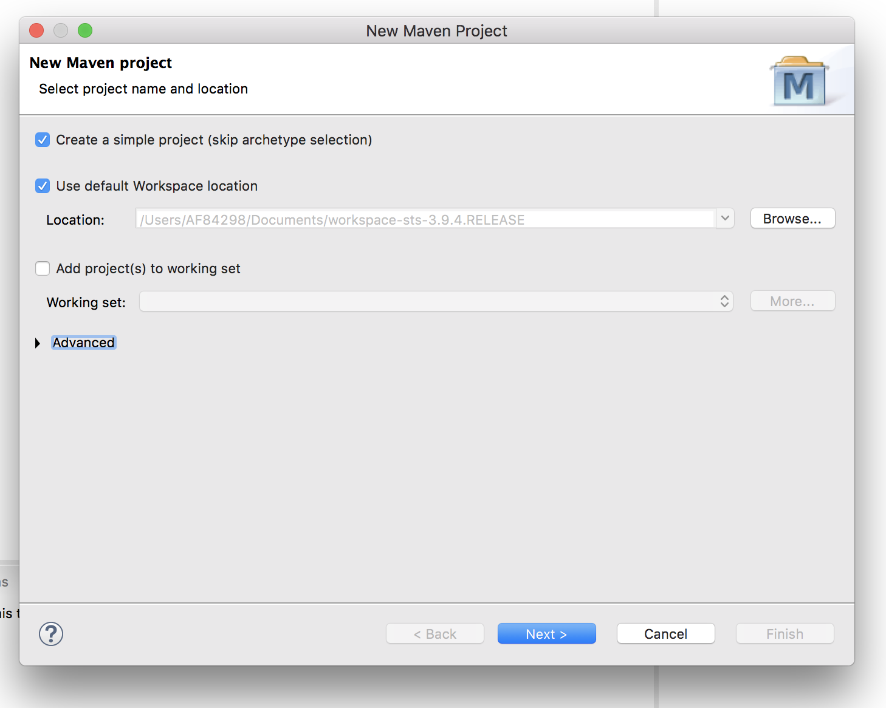
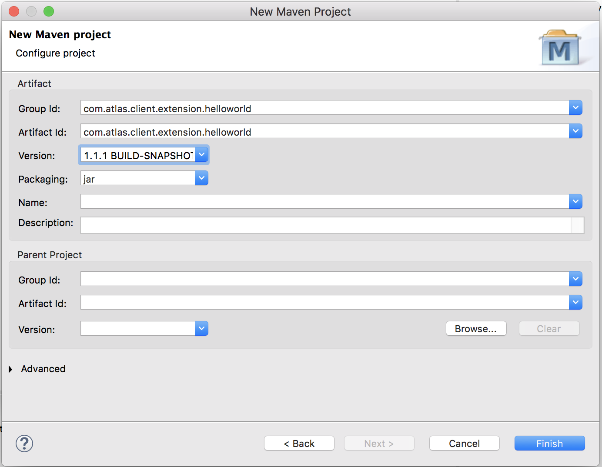
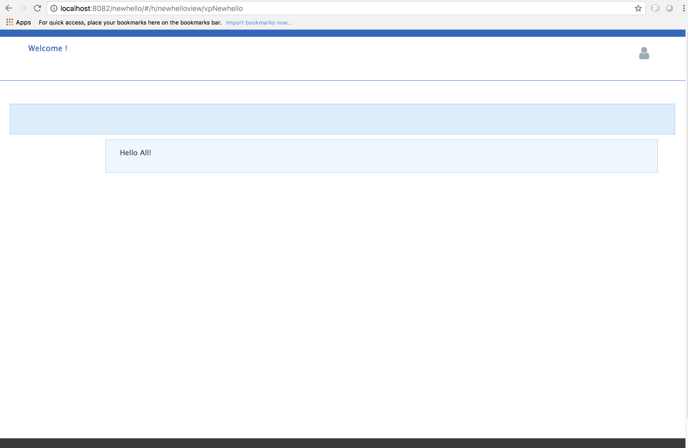
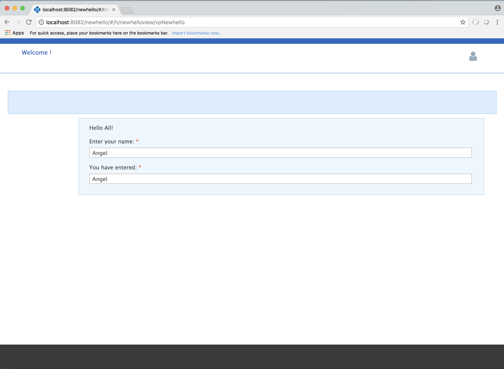

. Login to 
[blue]#**https://bitbucket.anthem.com/projects/NIM/repos/anthm-internal-oss-backend/browse**# and search for [navy]#**feature/1.0.0.RC1.**# Select the same from the drop-down
+
image::CL1.png[cl1]

.	Click the clone button and copy the hyperlink
[blue]#**
https://AF84298@bitbucket.anthem.com/scm/nim/anthm-internal-oss-backend.git **#

.	Open Terminal

.	Create a new folder named [navy]#**git**# in your cd /Users/AF84298 

.	Navigate to the folder and run the following command
+
[subs="quotes"]
-----------------------------------
**git clone -b feature/1.0.0.RC1 https://AF84298@bitbucket.anthem.com/scm/nim/anthm-internal-oss-backend.git** 
----------------------------------- 
. Let’s build the projects by typing the command
+
[subs="quotes"]
-----------------------------------
**sh build-projects.sh -am -** 
-----------------------------------
. We are done cloning the framework code in our local folder

=== Examples
==== Hello World 
===== Objective: 
To create a simple page which displays “Hello World! We have created our first application!”

===== Steps: 
. Open Spring Tool Suite. Right click on the project explorer area and select [navy]#** New->Maven Project**#

. You can see that your workspace location will be shown. Now check the [navy]#** Create simple project**# and click [navy]#** Next**#
+

. Enter the [navy]#** Group Id, Artifact Id **# and [navy]#**Version **# as follows and click Finish: 
+

. We follow a naming convention for  project’s group id, artifact id and version. This goes like com.atlas.client.extension.(name of your project)
. Now you can see the project in the Package Explorer area. 
. Update pom.xml 
.. Expand the folder and open pom.xml (file which contains the project configuration details used by Maven)
..	Add the parent class information
.. Add the project dependencies 
.. Add the plugins requires to configure this project
+

.**POM.xml**

[source,xml]
-------
<project xmlns="http://maven.apache.org/POM/4.0.0" xmlns:xsi="http://www.w3.org/2001/XMLSchema-instance" xsi:schemaLocation="http://maven.apache.org/POM/4.0.0 http://maven.apache.org/xsd/maven-4.0.0.xsd">
 <modelVersion>4.0.0</modelVersion>
 <groupId>com.atlas.client.extension.newhello</groupId>
  <artifactId>com.atlas.client.extension.newhello</artifactId>
  <version>1.1.1 BUILD-SNAPSHOT</version>
<parent>
		<groupId>com.antheminc.oss</groupId>
		<artifactId>nimbus-parent</artifactId>
		<version>1.0.0.RC1-SNAPSHOT</version>
	</parent>
	<dependencies>
		<dependency>
			<groupId>com.antheminc.oss</groupId>
			<artifactId>nimbus-core</artifactId>
			<exclusions>
				<exclusion>
					<groupId>de.flapdoodle.embed</groupId>
					<artifactId>de.flapdoodle.embed.mongo</artifactId>
				</exclusion>
			</exclusions>
		</dependency>
		<dependency>
			<groupId>com.antheminc.oss</groupId>
			<artifactId>nimbus-ui</artifactId>
		</dependency>
		<dependency>
			<groupId>com.antheminc.oss</groupId>
			<artifactId>nimbus-test</artifactId>
			<scope>test</scope>
		</dependency>

		<dependency>
			<groupId>org.springframework.boot</groupId>
			<artifactId>spring-boot-starter-security</artifactId>
		</dependency>
		<dependency>
			<groupId>org.springframework.boot</groupId>
			<artifactId>spring-boot-starter-tomcat</artifactId>
			<scope>provided</scope>
		</dependency>

		<dependency>
			<groupId>org.springframework.boot</groupId>
			<artifactId>spring-boot-configuration-processor</artifactId>
		</dependency>
		<dependency>
			<groupId>junit</groupId>
			<artifactId>junit</artifactId>
		</dependency>
		<dependency>
			<groupId>org.springframework.boot</groupId>
			<artifactId>spring-boot-starter-test</artifactId>
			<scope>test</scope>
		</dependency>
		<dependency>
			<groupId>org.springframework.ws</groupId>
			<artifactId>spring-ws-core</artifactId>
			<exclusions>
				<exclusion>
					<artifactId>commons-logging</artifactId>
					<groupId>commons-logging</groupId>
				</exclusion>
			</exclusions>
		</dependency>
		<dependency>
			<groupId>com.querydsl</groupId>
			<artifactId>querydsl-mongodb</artifactId>
		</dependency>
		<dependency>
			<groupId>com.querydsl</groupId>
			<artifactId>querydsl-apt</artifactId>
		</dependency>
		<dependency>
			<groupId>com.sleepycat</groupId>
			<artifactId>je</artifactId>
			<version>5.0.73</version>
		</dependency>
        <!-- tomcat-embed-jasper is only to enable support to render JSP page -->
		<dependency>
			<groupId>org.apache.tomcat.embed</groupId>
			<artifactId>tomcat-embed-jasper</artifactId>
			<scope>provided</scope>
		</dependency>
		<dependency>
			<groupId>com.h2database</groupId>
			<artifactId>h2</artifactId>
		
		</dependency>
		<dependency>
			<groupId>org.springframework.boot</groupId>
			<artifactId>spring-boot-devtools</artifactId>
			<optional>true</optional>
			<scope>runtime</scope>
		</dependency>

		<dependency>
			<groupId>de.flapdoodle.embed</groupId>
			<artifactId>de.flapdoodle.embed.mongo</artifactId>
			<scope>test</scope>
		</dependency>
		<dependency>
			<groupId>com.fasterxml.jackson.datatype</groupId>
			<artifactId>jackson-datatype-jsr310</artifactId>
		</dependency>
		<dependency>
			<groupId>org.apache.httpcomponents</groupId>
			<artifactId>httpclient</artifactId>
		</dependency>
	</dependencies>
  <build>
		<plugins>
			<plugin>
				<groupId>com.mysema.maven</groupId>
				<artifactId>apt-maven-plugin</artifactId>
				<version>1.1.3</version>
				<executions>
					<execution>
						<goals>
							<goal>process</goal>
						</goals>
						<configuration>
							<outputDirectory>${basedir}/target/generated-sources/annotations</outputDirectory>
							<processor>
								com.antheminc.oss.nimbus.domain.support.DomainQuerydslProcessor
							</processor>
						</configuration>
					</execution>
				</executions>
			</plugin>
					<plugin>
				<groupId>org.codehaus.mojo</groupId>
				<artifactId>build-helper-maven-plugin</artifactId>
				<executions>
					<execution>
						<id>add-extra-source</id>
						<phase>generate-sources</phase>
						<goals>
							<goal>add-source</goal>
						</goals>
						<configuration>
							<sources>
								<source>${basedir}/target/generated-sources/annotations</source>
							</sources>
						</configuration>
					</execution>
				</executions>
			</plugin>
		</plugins>
	</build>

	<repositories>
		<repository>
			<id>spring-snapshots</id>
			<name>Spring Snapshots</name>
			<url>https://repo.spring.io/snapshot</url>
			<snapshots>
				<enabled>true</enabled>
			</snapshots>
		</repository>
		<repository>
			<id>spring-milestones</id>
			<name>Spring Milestones</name>
			<url>https://repo.spring.io/milestone</url>
			<snapshots>
				<enabled>false</enabled>
			</snapshots>
		</repository>
	</repositories>

-------
. Build the project:
.. Right click the project folder and select [navy]#**Run as->m2 5 Mavenbuild.**# 
.. Enter ‘clean install’ in the [navy]#**Goals**# field
+

. Now, let’s create another project(web) by clicking [navy]#**New->Maven Project**# and enter the [navy]#**Group Id**#, [navy]#**Artifact Id**# and [navy]#**Version**# as follows and click [navy]#**Finish**#
+
. You can see the project in the Package Explorer area. 
. Update Pom.xml
.. Expand the folder and open pom.xml (file which contains the project configuration details used by Maven)
.. Add the parent class information
..	Add the project dependencies including the corresponding extension folder (highlighted in yellow)
.. Add the plugins requires to configure this project
+

.**POM.xml**

[source,xml]
------------
<project xmlns="http://maven.apache.org/POM/4.0.0" xmlns:xsi="http://www.w3.org/2001/XMLSchema-instance" xsi:schemaLocation="http://maven.apache.org/POM/4.0.0 http://maven.apache.org/xsd/maven-4.0.0.xsd">
  <modelVersion>4.0.0</modelVersion>
  <groupId>com.atlas.Helloworld-web</groupId>
  <artifactId>com.atlas.Helloworld-web</artifactId>
  <version>1.1.1 BUILD-SNAPSHOT</version>
  <parent>
		<groupId>com.antheminc.oss</groupId>
		<artifactId>nimbus-parent</artifactId>
		<version>1.0.0.RC1-SNAPSHOT</version>
	</parent>
  <properties>
  	<nimbus.version>1.0.0.RC1-SNAPSHOT</nimbus.version>
  </properties>

  <dependencies>
  	<dependency>
		<groupId>com.antheminc.oss</groupId>
		<artifactId>nimbus-core</artifactId>
		<exclusions>
			<exclusion>
				 <groupId>de.flapdoodle.embed</groupId>
        		 <artifactId>de.flapdoodle.embed.mongo</artifactId>
			</exclusion>			
		</exclusions>
	</dependency>
	<dependency>
		<groupId>com.antheminc.oss</groupId>
		<artifactId>nimbus-ui</artifactId>
	</dependency>
	<dependency>
		<groupId>com.antheminc.oss</groupId>
		<artifactId>nimbus-test</artifactId>
		<scope>test</scope>
	</dependency>
	<dependency>
	  <groupId>com.client.extension.helloworld</groupId>
  <artifactId>com.client.extension.helloworld</artifactId>
  <version>1.1.1 BUILD-SNAPSHOT</version>
		<exclusions>
			<exclusion>
				 <groupId>de.flapdoodle.embed</groupId>
        		 <artifactId>de.flapdoodle.embed.mongo</artifactId>
			</exclusion>
		</exclusions>
	</dependency>

	<dependency>
			<groupId>org.springframework.boot</groupId>
			<artifactId>spring-boot-starter-security</artifactId>
	</dependency>
	<dependency> 
		<groupId>org.springframework.boot</groupId> 
		<artifactId>spring-boot-starter-tomcat</artifactId> 
		<scope>provided</scope>
	 </dependency>   
	
 	<dependency>
		<groupId>org.springframework.boot</groupId>
		<artifactId>spring-boot-configuration-processor</artifactId>
	</dependency>
	<dependency>
		<groupId>junit</groupId>
		<artifactId>junit</artifactId>
	</dependency>
	<dependency>
		<groupId>org.springframework.boot</groupId>
		<artifactId>spring-boot-starter-test</artifactId>
		<scope>test</scope>
	</dependency>
	<dependency>
		<groupId>org.springframework.ws</groupId>
		<artifactId>spring-ws-core</artifactId>
		<exclusions>
			<exclusion>
				<artifactId>commons-logging</artifactId>
				<groupId>commons-logging</groupId>
			</exclusion>
		</exclusions>
	</dependency>
	<dependency>
	    <groupId>com.querydsl</groupId>
	    <artifactId>querydsl-mongodb</artifactId>
	</dependency>
	<dependency>
	    <groupId>com.querydsl</groupId>
	    <artifactId>querydsl-apt</artifactId>
	</dependency>
	<dependency>
		<groupId>com.sleepycat</groupId>
		<artifactId>je</artifactId>
		<version>5.0.73</version>
	</dependency>	
	<dependency>
	    <groupId>org.apache.tomcat.embed</groupId>
	    <artifactId>tomcat-embed-jasper</artifactId>
	    <scope>provided</scope>
	</dependency>

	<dependency>
	    <groupId>com.h2database</groupId>
	    <artifactId>h2</artifactId>
	    <!-- <scope>test</scope> -->
	</dependency>
	<dependency>
	    <groupId>org.springframework.boot</groupId>
	    <artifactId>spring-boot-devtools</artifactId>
	    <optional>true</optional>
	    <scope>runtime</scope>
	</dependency>
	<dependency>
	    <groupId>org.apache.httpcomponents</groupId>
	    <artifactId>httpclient</artifactId>
	</dependency>
  </dependencies>
  <build>
    <resources>
       <resource>
       <directory>${project.basedir}/src/main/resources</directory>
       </resource>      
    </resources>

  </build>
</project>

------------

. Build the project (Refer 7 under 2.1 section in Module 2)

. Create VRHelloworld.java class inside [navy]#**com.atlas.client.extension.helloworld -> src/main/java -> com.atlas.client.extension.helloworld **#
+
.**VRHelloworld.java** 

[source,java]
------------
//Necessary packages
import javax.validation.constraints.NotNull;
import com.antheminc.oss.nimbus.domain.defn.Domain;
import com.antheminc.oss.nimbus.domain.defn.MapsTo;
import com.antheminc.oss.nimbus.domain.defn.Model;
import com.antheminc.oss.nimbus.domain.defn.Model.Param.Values.Source;
import com.antheminc.oss.nimbus.domain.defn.Repo;
import com.antheminc.oss.nimbus.domain.defn.Domain.ListenerType;
import com.antheminc.oss.nimbus.domain.defn.MapsTo.Path;
import com.antheminc.oss.nimbus.domain.defn.MapsTo.Type;
import com.antheminc.oss.nimbus.domain.defn.ViewConfig.Form;
import com.antheminc.oss.nimbus.domain.defn.ViewConfig.Header;
import com.antheminc.oss.nimbus.domain.defn.ViewConfig.Page;
import com.antheminc.oss.nimbus.domain.defn.ViewConfig.Paragraph;
import com.antheminc.oss.nimbus.domain.defn.ViewConfig.Section;
import com.antheminc.oss.nimbus.domain.defn.ViewConfig.Tile;
import com.antheminc.oss.nimbus.domain.defn.ViewConfig.ViewRoot;
import com.antheminc.oss.nimbus.domain.defn.extension.Content.Label;
import com.antheminc.oss.nimbus.domain.model.config.ParamValue;

import lombok.Getter;
import lombok.Setter;
import lombok.ToString;

// Defining the Domain Entity 
@Domain(value ="helloworldview", includeListeners = {ListenerType.websocket})

//Repository values
@Repo(value=Repo.Database.rep_none,cache=Repo.Cache.rep_device)

//Generate Getter and Setter for the class
@Getter @Setter @ToString(callSuper=true)

//Layout of the Root
@ViewRoot(layout = "home")
public class VRHelloworld{
	
// Define a Page instance	 
@Page(defaultPage=true)
private VPHelloworld vpHelloworld;

// Define a Tile instance
@Model
@Getter @Setter
public static class VPHelloworld{

     @Tile(size = Tile.Size.Large)
     private VTHelloworld vtHelloworld;
}

// Add a Header variable and define a Section instance
@Model
@Getter @Setter
public static class VTHelloworld{

    @Header(size=Header.Size.H3)
    private String addHelloWorldHeader;

    @Section
    private VSHelloworld vsHelloworld;
}

// Define a Form instance which has one column
@Model
@Getter @Setter
public static class VSHelloworld{

        @Form(cssClass="oneColumn")
        private VFHelloworld vfHelloworld;
    }
 
//Define a Paragraph with the Label “Hello All”
@Model
    @Getter @Setter
    public static class VFHelloworld { 
	
	    @Paragraph
		@Label(value = "Hello ALL")
		private String title1;

         }
	}

------------

. Create VLHome.java class inside [navy]#**com.atlas.client.extension.helloworld  -> src/main/java -> com.atlas.client.extension.helloworld **#
+
.**VLHome.java** 

[source,java]
------------
import com.antheminc.oss.nimbus.domain.defn.Domain;
import com.antheminc.oss.nimbus.domain.defn.Domain.ListenerType;
import com.antheminc.oss.nimbus.domain.defn.Model;
import com.antheminc.oss.nimbus.domain.defn.ViewConfig.Hints;
import com.antheminc.oss.nimbus.domain.defn.ViewConfig.Initialize;
import com.antheminc.oss.nimbus.domain.defn.ViewConfig.Link;
import com.antheminc.oss.nimbus.domain.defn.ViewConfig.Page;
import com.antheminc.oss.nimbus.domain.defn.ViewConfig.PageHeader;
import com.antheminc.oss.nimbus.domain.defn.ViewConfig.Paragraph;
import com.antheminc.oss.nimbus.domain.defn.ViewConfig.Section;
import com.antheminc.oss.nimbus.domain.defn.ViewConfig.Hints.AlignOptions;
import com.antheminc.oss.nimbus.domain.defn.ViewConfig.PageHeader.Property;
import com.antheminc.oss.nimbus.domain.defn.ViewConfig.Section.Type;
import com.antheminc.oss.nimbus.domain.defn.extension.Content.Label;
import com.antheminc.oss.nimbus.domain.defn.Repo;
import com.antheminc.oss.nimbus.domain.defn.Repo.Cache;
import com.antheminc.oss.nimbus.domain.defn.Repo.Database;

import lombok.Getter;
import lombok.Setter;

@Domain(value="home", includeListeners={ListenerType.websocket}) 
@Repo(value = Database.rep_none, cache = Cache.rep_device)
@Getter @Setter
public class VLHome {
	
	@Page private VPHome vpHome;

	@Model @Getter @Setter
	public static class VPHome {
		
		@Section(Type.HEADER) 
		private VSHomeHeader vsHomeHeader;

	}
	@Model @Getter @Setter
	public class VSHomeHeader {
		
	
		@PageHeader(Property.APPTITLE)
		@Paragraph
		@Label(value = "Welcome !")
		private String title;
		
	}	
}

------------

. Create Application.java to start up our spring boot application and LoginController.java class inside [navy]#**com.atlas.helloworld-web -> src/main/java -> com.atlas.helloworld **#
+
.**Application.java** 

[source,java]
------------
import org.springframework.boot.SpringApplication;
import org.springframework.boot.autoconfigure.EnableAutoConfiguration;
import org.springframework.boot.autoconfigure.SpringBootApplication;
import org.springframework.boot.builder.SpringApplicationBuilder;
import org.springframework.boot.web.support.SpringBootServletInitializer;
import org.springframework.context.annotation.Bean;
import org.springframework.context.annotation.ComponentScan;
import org.springframework.context.annotation.Configuration;

import com.antheminc.oss.nimbus.domain.session.HttpSessionProvider;
import com.antheminc.oss.nimbus.domain.session.SessionProvider;

@Configuration
@SpringBootApplication(scanBasePackageClasses=LoginController.class)
@ComponentScan
@EnableAutoConfiguration
public class Application extends SpringBootServletInitializer {
	@Override
	protected SpringApplicationBuilder configure(SpringApplicationBuilder application){ 
		return application.sources(Application.class);
	} 
	public static void main(String[] args) throws Exception { 
		SpringApplication.run(Application.class, args);
	} 
	
	@Bean
	public SessionProvider sessionProvider() { 
		return new HttpSessionProvider();
------------
+
.**LoginController.java** 

[source,java]
------------
import java.util.Enumeration;
import java.util.List;

import javax.servlet.http.HttpServletRequest;
import javax.servlet.http.HttpServletResponse;

import org.slf4j.Logger;
import org.slf4j.LoggerFactory;
import org.springframework.beans.factory.annotation.Autowired;
import org.springframework.security.core.context.SecurityContextHolder;
import org.springframework.stereotype.Controller;
import org.springframework.ui.Model;
import org.springframework.web.bind.annotation.RequestMapping;
import org.springframework.web.bind.annotation.RequestMethod;
import org.springframework.web.bind.annotation.ResponseBody;
import com.antheminc.oss.nimbus.entity.client.access.ClientUserRole;
import com.antheminc.oss.nimbus.entity.client.user.ClientUser;
import com.antheminc.oss.nimbus.support.JustLogit;

@Controller
public class LoginController {

    @RequestMapping(value = "/login", method = RequestMethod.GET)
    public void login(HttpServletRequest request, HttpServletResponse response) throws Exception {
    response.sendRedirect("/helloworld/#/h/helloworldview/vpHelloworld");
        
    }
    
    private JustLogit _logger = new JustLogit(this.getClass());
}
------------
. Create application.yml file under [navy]#**com.atlas.client.extension.helloworld  -> src/main/resources **# to tell the framework about the classes we configured, database connection etc. . We can reuse this application.yml file for any of our applications by making changes to the following:
.. application name
..	context path
..	basePackages
+
.**Application.yml**
[source,xml]
-------------
spring:
  application:
    name: newhello

  data:
    mongodb:
      host: localhost
      database: helloworld
      port: 27017

  mvc:
    view:
      prefix: /
      suffix: .jsp
  sqldatasource:
    driver-class-name: oracle.jdbc.driver.OracleDriver

jwt:
  secret: nimbustest
  algorithm: HS512
  
process:
  key:
    regex:
     ([A-Za-z0-9_\\-\\*~\\?=\\.\\$]+)
  database:
    driver: 
      embeddedH2
    url: 
      embeddedH2
    username: 
      embeddedH2
    password: 
      embeddedH2
    taskUpdateQuery:
      update ACT_RU_TASK set TASK_DEF_KEY_ = ?, NAME_ = ? WHERE ID_=?
    executionUpdateQuery:
      update ACT_RU_EXECUTION set ACT_ID_ = ?  WHERE ID_=? AND ACT_ID_=?   
  history:
    level: 
      full
  definitions:
   - classpath*:process-defs/**.xml
  rules:
   - rules/**.drl  
  customDeployers:

platform:
  config:
    cookies:
      gateway:
        name: GATEWAYSESSIONID
        path: /
    
      api:
        name: APISESSIONID
        path: /

      sticky:
        name: STICKYSERVERID
        path: /
    secure:
      regex: "^[a-zA-Z0-9<>()\\[\\]@/: &.=?,$#_-]{1,1000}" 
server:
  port: 8082
  session: 
    timeout: 1800
  context-path: /newhello
#  context-path: /api
auth-server: http://localhost:8891
security:
  basic:
    enabled: false
  oauth2:
    resource:
      tokenInfoUri: ${auth-server}/auth-service/oauth/check_token
    client:
      clientId: nimbus
      clientSecret: xfer498
  

domain:
  model:
    basePackages: 
      - com.atlas.client.extension.newhello.core
      - com.atlas.client.extension.newhello.view
    typeClassMappings:
      java.lang.String : 
        string
    includeFilter: ['a','b']
    persistenceStrategy: ATOMIC
  action: abc
    
  validation:
    markerAnnotations:
      javax.validation.Constraint
    markerInterfaces:

staticResourcesPath: ./target/webapp/
}
-------------

. 	Build the project(Refer 7 under 2.1 section in Module 2)
. Run the application: 
.. Right click on [navy]#**com.atlas.helloworld-web , click on Run as->Spring Boot App **#
.. Wait to the see the [green]#**Started Application in 8.378 seconds (JVM running for 10.342)**# log in the console
. Open your browser and go to [blue]#** http://localhost:8082/helloworld/login**# to view your output
+

==== Form Elements
===== Objective: 
To add form elements like Textbox, Radio button, Check box, Signature and Submit button to our Hello World page.

===== Steps:
. Let’s add these form elements to our webpage with the help of simple annotations.
. Open **VRHelloworld.java ** and update as follows 
+
.**VRHelloWorld.java**
[source, java]
------------
package com.client.extension.helloworld;

import java.util.ArrayList;
import java.util.List;
import javax.validation.constraints.NotNull;
import com.antheminc.oss.nimbus.domain.defn.Domain;
import com.antheminc.oss.nimbus.domain.defn.MapsTo;
import com.antheminc.oss.nimbus.domain.defn.Model;
import com.antheminc.oss.nimbus.domain.defn.Model.Param.Values.Source;
import com.antheminc.oss.nimbus.domain.defn.Repo;
import com.antheminc.oss.nimbus.domain.defn.Domain.ListenerType;
import com.antheminc.oss.nimbus.domain.defn.MapsTo.Path;
import com.antheminc.oss.nimbus.domain.defn.MapsTo.Type;
import com.antheminc.oss.nimbus.domain.defn.ViewConfig.Button;
import com.antheminc.oss.nimbus.domain.defn.ViewConfig.ButtonGroup;
import com.antheminc.oss.nimbus.domain.defn.ViewConfig.CheckBoxGroup;
import com.antheminc.oss.nimbus.domain.defn.ViewConfig.Form;
import com.antheminc.oss.nimbus.domain.defn.ViewConfig.Header;
import com.antheminc.oss.nimbus.domain.defn.ViewConfig.Page;
import com.antheminc.oss.nimbus.domain.defn.ViewConfig.Paragraph;
import com.antheminc.oss.nimbus.domain.defn.ViewConfig.Radio;
import com.antheminc.oss.nimbus.domain.defn.ViewConfig.Section;
import com.antheminc.oss.nimbus.domain.defn.ViewConfig.Signature;
import com.antheminc.oss.nimbus.domain.defn.ViewConfig.StaticText;
import com.antheminc.oss.nimbus.domain.defn.ViewConfig.TextBox;
import com.antheminc.oss.nimbus.domain.defn.ViewConfig.Tile;
import com.antheminc.oss.nimbus.domain.defn.ViewConfig.ViewRoot;
import com.antheminc.oss.nimbus.domain.defn.extension.Content.Label;
import com.antheminc.oss.nimbus.domain.model.config.ParamValue;

import lombok.Getter;
import lombok.Setter;
import lombok.ToString;

// Defining the Domain Entity 
@Domain(value ="helloworldview", includeListeners = {ListenerType.websocket})

//Repository values
@Repo(value=Repo.Database.rep_none,cache=Repo.Cache.rep_device)

//Generate Getter and Setter for the class
@Getter @Setter @ToString(callSuper=true)

//Layout of the Root
@ViewRoot(layout = "home")
public class VRHelloworld{
	
// Define a Page instance	 
@Page(defaultPage=true)
private VPHelloworld vpHelloworld;

// Define a Tile instance
@Model
@Getter @Setter
public static class VPHelloworld{

     @Tile(size = Tile.Size.Large)
     private VTHelloworld vtHelloworld;
}

// Add a Header variable and define a Section instance
@Model
@Getter @Setter
public static class VTHelloworld{

    @Header(size=Header.Size.H3)
    private String addHelloWorldHeader;

    @Section
    private VSHelloworld vsHelloworld;
}

// Define a Form instance which has one column
@Model
@Getter @Setter
public static class VSHelloworld{

        @Form(cssClass="oneColumn")
        private VFHelloworld vfHelloworld;
    }
 
//Define a Paragraph with the Label “Hello All”
@Model
    @Getter @Setter
    public static class VFHelloworld { 
	
	    @Paragraph
		@Label(value = "Hello All!")
		private String title1;

       // Creates a Textbox which is not null and has the label Name  
         @TextBox @NotNull 
         @Label(" Name") private String name;
        
        /* Creates a CheckBox which changes on an event 
           with the label Choose an option and has options defined 
           in YNType.class 
        */
         @CheckBoxGroup(postEventOnChange = true) 
	  @Model.Param.Values(value = YNType1.class) 
	  @Label(value = "Skill Set") private String checkbox;   

      /* Creates a RadioButton which changes on an event 
         with the label Choose an option and has options defined 
         in YNType.class 
      */ @Radio(postEventOnChange = true) 
	  @Model.Param.Values(value = YNType.class) 
         @Label(value = "Years of Experience") private String radio; 
   
        /* Creates a Signature box which accepts signature and 
           has the label  Signature
        */
         @Signature(postEventOnChange=true)
         @Label(" Signature") private String signature;
         
         // Creates a Button with style PRIMARY and has the label Submit 
         @Button(style=Button.Style.PRIMARY) 
         @Label(" Submit") 
         private String submit;
}
        /* YNTypeclass creates a List which accept values of the
           type ParamValue and has values 0-2 yrs,2-5 yrs, Above 5 yrs 
        */
    	  public static class YNType implements Source 
	  { 
	     @Override
	      public List<ParamValue> getValues(String paramPath) 
	       { 
	         List<ParamValue> values = new ArrayList<>(); 
	          values.add(new ParamValue("0", "0-2 yrs")); 
	          values.add(new ParamValue("2", "2-5 yrs")); 
	          values.add(new ParamValue("5", "Above 5 yrs")); 
	          return values; 
	        }
	   }

        /* YNTypeclass1 creates a List which accept values of the
           type ParamValue and has values Core Java,Spring MVC, Spring Cloud,
           DevOps    
        */

	   public static class YNType1 implements Source 
	   { 
	      @Override
	        public List<ParamValue> getValues(String paramPath) 
	         { 
	          List<ParamValue> values = new ArrayList<>(); 
	          values.add(new ParamValue("CJ", "Core Java")); 
	          values.add(new ParamValue("SM", "Spring MVC")); 
	          values.add(new ParamValue("SC", "Spring Cloud")); 
	          values.add(new ParamValue("De", "DevOps")); 
	          return values; 
	         }
	      }     
}

------------

.. Build (Refer 7 under 2.1 section in Module 2)and run the application.
.. Output:
+

==== Using drools within framework
===== Objective: 
How to change the state of the variable with the help of a drools file

===== Steps: 

. Let’s create a form with 2 textbox form elements:
+
.*VRHelloWorld*
[source,java]
------------
package com.atlas.client.extension.newhello;

import javax.validation.constraints.NotNull;
import com.antheminc.oss.nimbus.domain.defn.Domain;
import com.antheminc.oss.nimbus.domain.defn.Model;
import com.antheminc.oss.nimbus.domain.defn.Repo;
import com.antheminc.oss.nimbus.domain.defn.Domain.ListenerType;
import com.antheminc.oss.nimbus.domain.defn.ViewConfig.Form;
import com.antheminc.oss.nimbus.domain.defn.ViewConfig.Header;
import com.antheminc.oss.nimbus.domain.defn.ViewConfig.Page;
import com.antheminc.oss.nimbus.domain.defn.ViewConfig.Paragraph;
import com.antheminc.oss.nimbus.domain.defn.ViewConfig.Section;
import com.antheminc.oss.nimbus.domain.defn.ViewConfig.TextBox;
import com.antheminc.oss.nimbus.domain.defn.ViewConfig.Tile;
import com.antheminc.oss.nimbus.domain.defn.ViewConfig.ViewRoot;
import com.antheminc.oss.nimbus.domain.defn.extension.Content.Label;
import com.antheminc.oss.nimbus.domain.defn.extension.Rule;

import lombok.Getter;
import lombok.Setter;
import lombok.ToString;

@Domain(value ="newhelloview", includeListeners = {ListenerType.websocket})
@Repo(value=Repo.Database.rep_none,cache=Repo.Cache.rep_device)
@Getter @Setter @ToString(callSuper=true)
@ViewRoot(layout = "home")
public class VRNewhello {

	 @Page(defaultPage=true)
	    private VPNewhello vpNewhello;

@Model
@Getter @Setter
public static class VPNewhello{

  @Tile(size = Tile.Size.Large)
  private VTNewhello vtNewhello;
}

@Model
@Getter @Setter
public static class VTNewhello{

 @Header(size=Header.Size.H3)
 private String addHelloWorldHeader;

 @Section
 private VSNewhello vsNewhello;
}
@Model
@Getter @Setter
public static class VSNewhello{

     @Form(cssClass="oneColumn")
     private VFNewhello vfNewhello;
 }

@Model
 @Getter @Setter
 public static class VFNewhello { 
	
	    @Paragraph
		@Label(value = "Hello All!")
		private String title1;

	   // Listens to an event change in the textbox
        @TextBox(postEventOnChange=true) @NotNull 
        @Label("Enter your name:")
        @Rule("sample")
         private String itname;
       
        @TextBox @NotNull 
        @Label(" You have entered:") private String otname;
}
}
------------

. Create [navy]#**VLHome.java **# class inside [navy]#**com.atlas.client.extension.newhello  -> src/main/java -> com.atlas.client.extension.newhello **#
+
.*VLHome*
[source,java]
------------
import com.antheminc.oss.nimbus.domain.defn.Domain;
import com.antheminc.oss.nimbus.domain.defn.Domain.ListenerType;
import com.antheminc.oss.nimbus.domain.defn.Model;
import com.antheminc.oss.nimbus.domain.defn.ViewConfig.Hints;
import com.antheminc.oss.nimbus.domain.defn.ViewConfig.Initialize;
import com.antheminc.oss.nimbus.domain.defn.ViewConfig.Link;
import com.antheminc.oss.nimbus.domain.defn.ViewConfig.Page;
import com.antheminc.oss.nimbus.domain.defn.ViewConfig.PageHeader;
import com.antheminc.oss.nimbus.domain.defn.ViewConfig.Paragraph;
import com.antheminc.oss.nimbus.domain.defn.ViewConfig.Section;
import com.antheminc.oss.nimbus.domain.defn.ViewConfig.Hints.AlignOptions;
import com.antheminc.oss.nimbus.domain.defn.ViewConfig.PageHeader.Property;
import com.antheminc.oss.nimbus.domain.defn.ViewConfig.Section.Type;
import com.antheminc.oss.nimbus.domain.defn.extension.Content.Label;
import com.antheminc.oss.nimbus.domain.defn.Repo;
import com.antheminc.oss.nimbus.domain.defn.Repo.Cache;
import com.antheminc.oss.nimbus.domain.defn.Repo.Database;

import lombok.Getter;
import lombok.Setter;

@Domain(value="home", includeListeners={ListenerType.websocket}) 
@Repo(value = Database.rep_none, cache = Cache.rep_device)
@Getter @Setter
public class VLHome {
	
	@Page private VPHome vpHome;

	@Model @Getter @Setter
	public static class VPHome {
		@Section(Type.HEADER) 
		private VSHomeHeader vsHomeHeader;

	}
	@Model @Getter @Setter
	public class VSHomeHeader {
		
		@PageHeader(Property.APPTITLE)
		@Paragraph
		@Label(value = "Welcome !")
		private String title;
		
	}	
}
------------

. Create [navy]#**sample.drl**# inside 
[navy]#**com.atlas.client.extension.newhello  -> src/main/resources**#
+
[navy]#**Sample.drl:**# This rules file contains details on how the state of the form variables are set through web sockets. 
+
[source, java]
------------
import com.antheminc.oss.nimbus.domain.model.state.internal.DefaultParamState;

rule "output"
when
$core : DefaultParamState($core.findParamByPath("/../itname").getState()!=null)
then
$core.findParamByPath("/../otname").setState($core.findParamByPath("/../itname").getState());
End
------------

. Create and make changes to [navy]#**pom.xml**#(Refer 1.10 in Module II) , [navy]#**Application.class & LoginController.class**# (Refer 15 under 2.1 in Module II) and [navy]#**application.yml**# (Refer 14 under 2.1 in Module II) accordingly
. Build the project (Refer 7 under 2.1 section in Module 2)
. Run the application and view the output: 
.. Open your browser and go to [navy]#** http://localhost:8082/newhello/login **# to view your screen.
.. Enter text in the first textbox
+
image::DR1.png[DR1]

.. Now, click on the second textbox to see the text you have entered.
+

